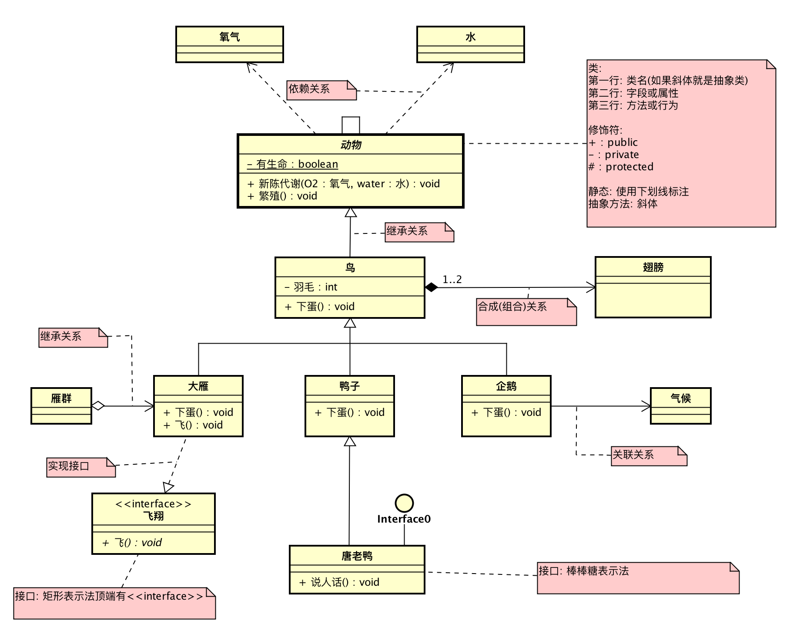
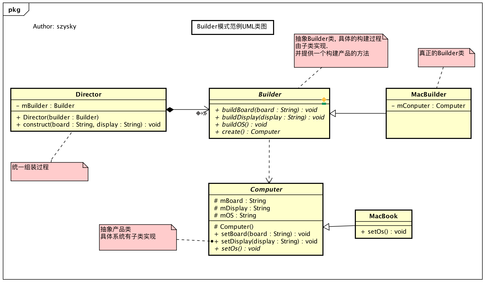
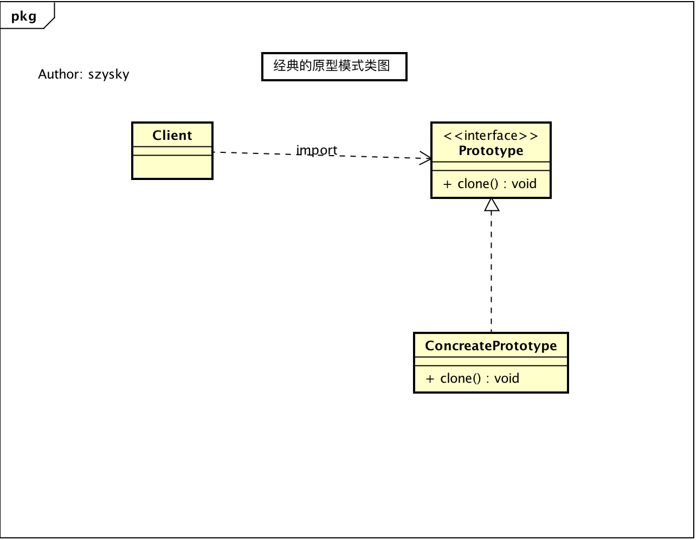
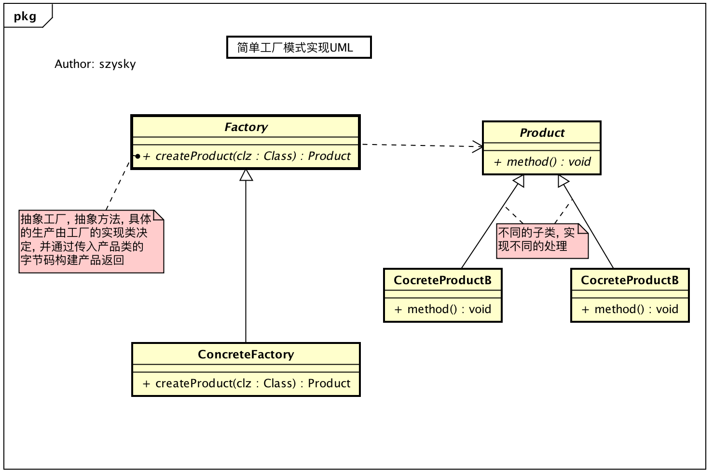
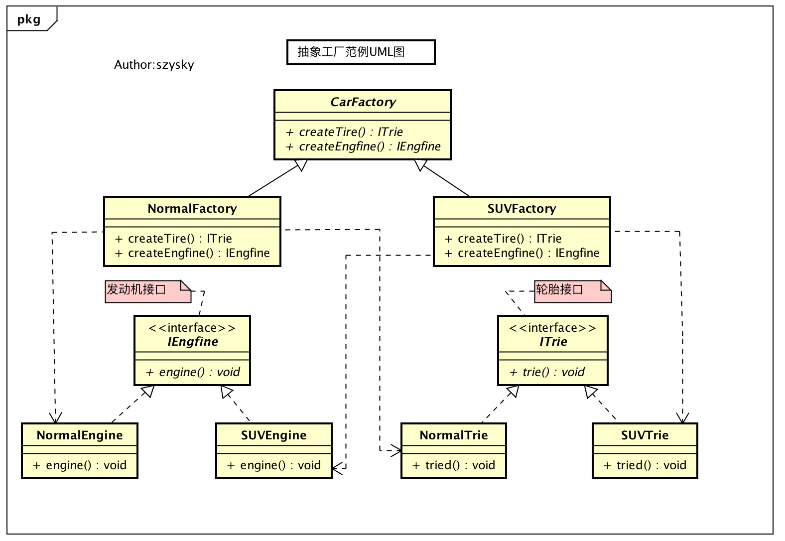
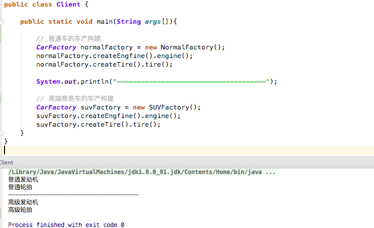
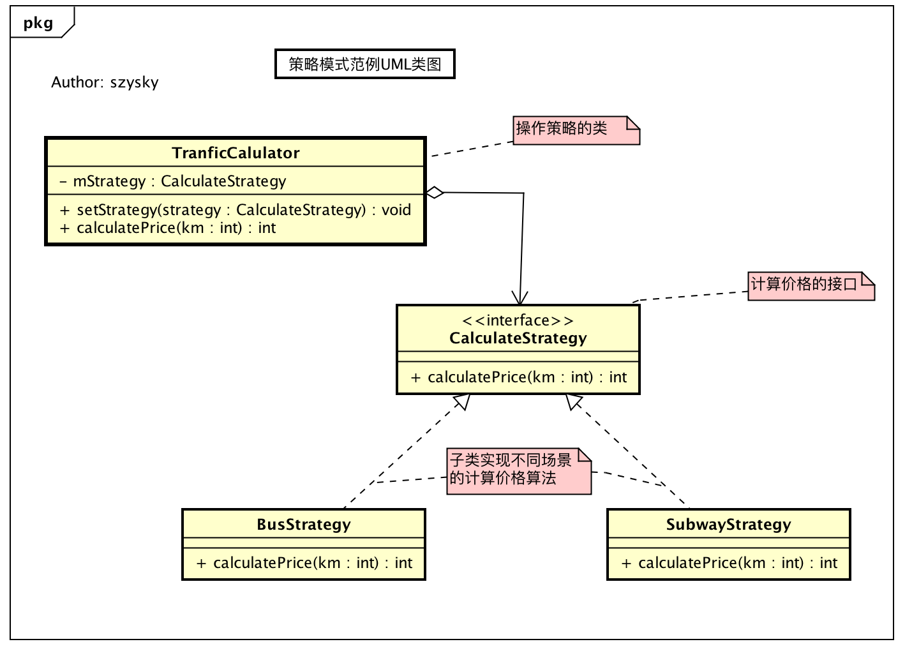
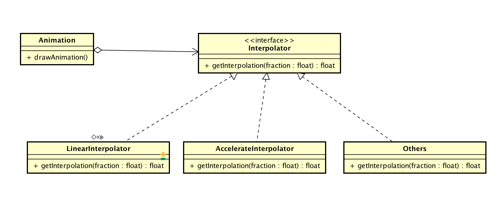

> 试图看懂 --> 试图模仿 --> 试图记住 --> 试图熟练

> 对于设计模式这是牛人们对代码中的一定场景而进行提炼的结果, 对于一个进阶的开发人员这是一个必不可少的技能. 当代码越写越好, 更易扩展更加灵活. 这对于Coder来说是最酷的事情.

> 通过`设计模式`和`Android源码`中的关系, 可以更加清楚的记住各个模式的特点, 和源码中的实现方式. **多练多分析之间的关系**这是必不可少的一步!


* [设计模式与Android(篇一)](https://github.com/suzeyu1992/repo/tree/master/project/design-pattern/%E7%9E%B0-%E8%AE%BE%E8%AE%A1%E6%A8%A1%E5%BC%8F%E4%B8%8EAndroid(%E7%AF%87%E4%B8%80))  
* [设计模式与Android(篇二)](https://github.com/suzeyu1992/repo/tree/master/project/design-pattern/%E7%9E%B0-%E8%AE%BE%E8%AE%A1%E6%A8%A1%E5%BC%8F%E4%B8%8EAndroid(%E7%AF%87%E4%BA%8C))
* [设计模式与Android(篇三)](https://github.com/suzeyu1992/repo/tree/master/project/design-pattern/%E7%9E%B0-%E8%AE%BE%E8%AE%A1%E6%A8%A1%E5%BC%8F%E4%B8%8EAndroid(%E7%AF%87%E4%B8%89))

本篇就是`<Android源码设计模式分析>`一书的缩减版. 这本书挺不错的. 片中类图讲解出自`<大话设计模式>`


* [灵活之路 - 面向对象六大原则](#1)
* [启航之路 - UML类图说明](#2)
* [发现之路 - 23种设计模式](#3)
    * [单例模式 Singleton](#4)
        * [模式介绍](#5)
        * [模式范例](#6)
        * [Android源码模式实现](#7)
    * [建造者模式 Builder](#8) 
        * [模式介绍](#9)
        * [模式范例](#10)
        * [Android源码模式实现](#11) 
        * [实战场景](#12) 
    * [原型模式 Prototype](#13)
        * [模式介绍](#14)
        * [模式范例](#15)
        * [Android源码模式实现](#16) 
        * [实战场景](#17) 
    * [工厂方法模式 Factory](#18)
        * [模式介绍](#19)
        * [模式范例](#20)
        * [Android源码模式实现](#21) 
        * [实战场景](#22) 
    * [抽象工厂模式 Abstract Factory](#23)
        * [模式介绍](#24)
        * [模式范例](#25)
        * [Android源码模式实现](#26) 
    * [策略模式 Strategy](#27)
        * [模式介绍](#28)
        * [模式范例](#29)
        * [Android源码模式实现](#30) 
        * [实战场景](#31) 

    
  <a name="1"/>  
## 灵活之路 - 面向对象六大原则

`如果下面文字描述,不是很明白那么跳转到后面链接有详细代码说明`[原则解析](http://szysky.com/2016/11/28/%E8%AE%BE%E8%AE%A1%E6%A8%A1%E5%BC%8F%E4%B9%8B%E5%85%AD%E5%A4%A7%E5%8E%9F%E5%88%99%E8%A7%A3%E6%9E%90/)

* `单一职责原则SRP(Single Responsibility Principle)`
    * `定义`: 就一个类而言, 应该仅有一个引起它的变化的原因. `通俗点`就是一个类应该是相关性很高数据封装
    * `举例`: 现在有一个图片加载类. 但是这个类内部包含了**图片下载的逻辑**,**图片缓存的逻辑**这样就使得这个类的职责过多, 随着功能的不断完善, 这个类的代码和逻辑也变得纵横交错混合在了一起. 对于后续的修改维护扩展都是不利的. 所以让两个类组合起来, 一个类内部只负责**图片下载**,另一个类内部负责**图片缓存**. 保持每个类的**单一职责**
* `开闭原则OCP(Open Close Principle)`
    * `定义`: 软件中的对象应该对于**扩展**是**开放**的 但是对于**修改**是**封闭**的.  `通俗点` : 尽量通过**扩展的方式**来实现变化,  而不是通过修改已有的代码来实现.
    * `举例`: 此时我们实现了一个**双缓存类**和**单缓存类**. 在**图片加载类**中进行这两个缓存类的实例. 并对外暴露一个布尔值让用户设置是否使用双缓存来决定内部缓存的逻辑. ok. 目前看可能没有问题. 但是如果有一个更好的缓存算法类, 这时候每次都需要在**图片加载类中修改代码**. 这就违反了`OCP`原则, 利用**继承,接口**的特性可以让此类问题得以解决. 比如: 我们可以定义一个`缓存接口`, 在**加载类**中使用的个这个接口中的方法. 而这个接口的具体实现通过暴露一个方法让外部调用的时候传入, 以后如果有新的缓存类只需要调用方法传入接口的子类就可以. 这样就对于原始代码修改进行了关闭, 而对于扩展是开放的.  
* `里氏替换原则LSP(Liskov Substitution Principle)`
    * `定义`: 所有引用基类的地方必须能透明地使用其子类. `通俗点`:是基于继承,多态两大特性. 再简单点**抽象**
    * `举例`: `Window#show(View view)`这个方法接收一个**View**, 但是我们可以`Button`,`TextView`等等. 其实很简单. 我们常用只不过不知道这个名字而已. 所以`LSP`的原则的核心就是**抽象**. 抽象又依赖于继承这个特性. **通常开闭原则和里氏替换是不离不弃的**例如上面`OCP`中举得例子. 在外部调用就是利用了继承的特性, 也就是**里氏替换**
* `依赖倒置原则DIP(Dependence Inversion Principle)`
    * `定义`: 指代了一种特定的解耦形式, 使得高层次的模块不依赖于低层次的模块的实现细节的目的, 依赖模块被颠倒了. `通俗点`: 在Java中依赖抽象(接口,抽象类), 而不依赖具体实现类. 模块之间的依赖通过**抽象**发生, 实现类之间不发生直接的依赖关系, 其依赖关系是通过接口或抽象类产生.
    * `举例`: 还是在`OCP`中的例子, 内部加载类依赖于也就是成员变量是`缓存接口`, 而不是具体的某一个`单缓存`或者`双缓存`的实现类. 
* `接口隔离原则ISP(Interface Segregation Principles)`
    * `定义`: 接口的依赖关系应该建立在最小的接口上. `通俗点`:接口隔离原则的目的是系统解开耦合, 从而容易重构, 更改和重新部署.
    * `举例`: 在操作一些**IO文件,网络**的时候我们总是伴随着`try...catch...finally`. 在最终调用块中调用`close()`确保资源可以正确的释放. 但这样这样的代码不仅可读性差可以每次都是写一些冗余的模板代码. 其实可以提供一个静态方法, 而根据java中的的特性,之上操作的对象都会实现一个**标识接口Closeable**,这个接口标识了一个可关闭的对象有一个`close()`. 所以这个静态方法的形参接收一个`Closeable`接口,并在方法内调用`close()`即可.  仔细想想: 这个方法的形参在调用的时候传入的实参是**里氏替换原则**, 而方法内部调用的是一个接口的`close()`方法,但传入的可能是某一个实现类,那么这不就是**依赖导致原则**,并且建立在最小化的依赖基础上, 只要知道这个对象是可关闭的, 别的一概不关心, 这就是**接口隔离原则**. 
* `迪米特原则LOD(Law of Demeter)`
    * `定义`: 一个对象应该对其他对象有**最少**的了解. `通俗点`: 一个类应该对自己需要耦合或调用的类知道的最少, 类的内部如果实现与调用者或者依赖者没有关系, 调用者或者依赖者只需要知道他需要的方法即可, 其他一概不管.
    * `举例`: 房间类, 中介类, 上班族类.  可以**上班族**应该只关心**中介类**, 而不需要关注**房间类**. 只需要**中介类**返回房子的地址即可. 而不需要通过调用**中介类**返回一个**房间类** . 这也就是代码中需要注意的. 不要过度耦合, 要降低类之间的关系. 

  <a name="2"/> 
## 启航之路 - UML类图说明

> 对于许多类组成的庞大关系网, 最好的办法是通过图来表示出其关系. 可以直观的看出组合的元素, 元素直接是如何存在的, 元素与哪些元素直接存在着联系等. 表示出来的图就是`UML类图`.

可以看如下一个稍微完整的一个`UML类图`

 

---

**组成元素**

* `类和接口`: 通过黄色的矩形框来表示一个类, 例如上面鸟就是一个**普通类**, 如果类名是斜体那么就是**抽象类**, 如果和**飞翔**或者**唐老鸭**的表示法那么就是接口. 
* `访问权限`: 通过`+ 公共权限`, `- 私有权限`, `# 保护权限`
* `变量和方法`: 分别在第二行, 和第三行表示,抽象方法同样斜体表示, 静态属性的用下划线表示. 

---

**关系结构**

* `继承关系`: 类与类之间的关系, 通过**空心三角+实线**表示, 通过**箭头的方向指向父类**表述关系.
* `实现关系`: 类与接口直接的关系, 通过**空心三角+虚线**表示, 通过**箭头的方向指向接口**表述关系.
* `关联关系`: 当一个类知道另一个类的时候,可以使用**关联**, 比如企鹅和气候两个类中, `企鹅类的变量有气候类的引用`, 这个时候就如上图之间的关系. **实线箭头**表示, **箭头指向被知道的类**
* `依赖关系`: 例如**动物**是依赖**氧气和水的**, 就如`动物类中的方法形参类型依赖这两个类型`. 如上图动物和水之间关系. 使用**虚线箭头**, **箭头指向被依赖的类**
* `聚合关系`: 表示一种弱拥用, A可以包含B, 但B不可以包含A. 如大雁和雁群两个类. 雁群类中会有一个数组,数组的元素是大雁类型. 这之间就是`聚合`. 使用**空心菱形+实线箭头**
* `合成关系`: 也可以认为是`组合`. 是一种强拥有关系. 例如鸟类和翅膀类, 鸟类是整体, 翅膀类是部分. 并且其生命周期相同, 对应着就是**在鸟类初始化的时候,翅膀类也会随之初始化**. 并且, 上图中的鸟到翅膀还有`1..2`的字样. 这称为**基数**. 表明一段会有几个实例, 例如一个鸟会有两个翅膀. 如果一个类有无数个实例那就用`n`表示. `关联关系`,`聚合关系`也是可以有**基数**的. 使用**实心菱形+实线箭头**表示.


> 编程是门技术, 更加是一门艺术, 不能只满足代码结果运行正确就完事, 时常考虑如果让代码更加简练, 更加容易维护, 更易扩展和复用, 这样才可以真正提高. 

  <a name="3"/> 
## 发现之路 - 23种设计模式

  <a name="4"/> 
### 单例模式 Singleton

  <a name="5"/> 
#### 模式介绍

* `定义`: 确保某个类只有一个实例, 而且自行实例化并向整个系统提供这个实例.
* `场景`: 确保一个类只会有一个对象实例, 避免产生多个对象消耗过多的资源, 或者某种类型的对象只应该有且只有一个. 如创建一个对象需要消耗的资源过多, 访问IO和数据库等资源时就可以考虑单例. 

  <a name="6"/> 
#### 模式范例

单例模式的实现有5种. 

* 饿汉式单例 --> [实现代码](https://github.com/suzeyu1992/AlgorithmTraining/blob/master/src/design/single/HungrySingle.java)
* 懒汉式单例 --> [实现代码](https://github.com/suzeyu1992/AlgorithmTraining/blob/master/src/design/single/LazySingle.java)
* 静态内部类单例 --> [实现代码](https://github.com/suzeyu1992/AlgorithmTraining/blob/master/src/design/single/InnerStaticSingle.java)
* 枚举单例 --> [实现代码](https://github.com/suzeyu1992/AlgorithmTraining/blob/master/src/design/single/EnumSingle.java)
* 容器实现单例 --> [实现代码](https://github.com/suzeyu1992/AlgorithmTraining/blob/master/src/design/single/CollectionSingle.java) 这种方式在`android`源码中存在.


---

**知识扩展**

`枚举实现法`最大的优点就是实现简单, 但是在`android`却比较消耗内存. 有一点与其他单例模式不同的是: 默认枚举实例的创建`是线程安全的`. 为什么? 因为其他的单例在一种特定的场合下会重新创建对象,那就是`反序列化`.

`反序列化`是从磁盘读回数据并创建一个新的对象. 即使构造函数是私有的, 反序列化依然可以通过特殊的途径去创建一个实例, 相当于调用了构造函数. 反序列化提供了一个很特别的`钩子函数`, 类中具有一个私有的, 被实例化的方法`readResolver()`, 这个方法可以让开发人员控制对象的反序列化. 例如上面的几个单例模式, 如果想杜绝单例对象在被反序列化时重新生成对象, 那么必须加入如下方法:


```java
private Object readResolve() throws ObjectStreamException(){
    return sInstent;        // 返回单例中的实例对象
}
```

这样在反序列化的时候就不是默认的重新生成一个新对象. 而对于枚举,并不存在这个问题. 因为即使反序列化它也不会重新生成新的实例.

  <a name="7"/> 
#### Android源码对应模式


我们经常会在`Activity`中通过`getSystemService(String name)`这个函数来获取系统的服务, 比如说`WMS`,`AMS`,`LayoutInflater`等等. 这些服务都会在某一时刻以`容器单例`的形式保存在应用中. 

以`Adapter#getView()`中使用布局加载器`LayoutInflate.from(context).inflate(layoutId,null)`为例

会调用`ContextImpl#getSystemService(String)`方法获取服务, 而方法内部只是从一个`SYSTEM_SERVICE_MAP`名字的集合中获取了一个`ServiceFetcher`对象, 并从其中获取具体的服务返回. 

那么我们可以缕一下应用的启动, 并定位到何时保存的这些服务到这个集合的.

1. 首先应用的入口为`ActivityThread#main()`,在这个函数里面会创建`ActivityThread`对象, 并启动消息循环(UI)线程, 调用`attach(boolean)`函数
2. 在`attach(boolean)`中通过`Binder`机制与`ActivityManagerService`通信, 最终回调本类的`handlelaunchActivity()`函数.
3. 然后执行`PerformLaunchActivity()`函数, 开始创建`Application`,`Context`,`Activity`, 并把上下文关联到`Activity`中, 最终调用`Activity#onCreate()`

ok刚才大概流程是这样的,  通过之前的分析我们知道, 各个系统服务是保存在`ContextImpl类中的`, 这个类是在上面的第3步中被初始化的.  看如下代码, 就是服务被注册的代码, 时机也就是第一个`Context`被创建的时候. 


```java
class ContextImpl extends Context {
    // 存储所有系统服务的集合
    private static final HashMap<String, ServiceFetcher> SYSTEM_SERVICE_MAP =new HashMap<String, ServiceFetcher>();
    
    // 一个注册服务的并添加到结合的方法
    private static void registerService(String serviceName, ServiceFetcher fetcher) {
       if (!(fetcher instanceof StaticServiceFetcher)) {
           fetcher.mContextCacheIndex = sNextPerContextServiceCacheIndex++;
       }
       SYSTEM_SERVICE_MAP.put(serviceName, fetcher);
    }
    
    // 静态语句块, 只在类第一次被加载的时候调用, 保证了服务只被添加一次.
    static {
        // 注册了LayoutInflate服务
        registerService(LAYOUT_INFLATER_SERVICE, new ServiceFetcher() {
                public Object createService(ContextImpl ctx) {
                    return PolicyManager.makeNewLayoutInflater(ctx.getOuterContext());
                }});
                
        registerService(INPUT_SERVICE, new StaticServiceFetcher() {
                public Object createStaticService() {
                    return InputManager.getInstance();
                }});

        /**
         *  后面省略一大坨的注册的服务代码
        **/
    }
    
}
```


  <a name="8"/> 
### 建造者模式 Builder

  <a name="9"/> 
#### 模式介绍

> 一个复杂的对象有很多组成成分, 如汽车, 车轮, 方向盘, 发动机,等等. 为了在构建过程中对外部隐藏实现细节, 就可以使用`Builder`模式将部件和组装过程分离, 使得构建过程和部件都可以自由扩展, 两者之间的耦合也将到了最低.

* `定义`: 将一个复杂对象的构建与它的表示分离, 使得同样的构建过程可以创建不同的表示. 
* `场景`:
    1. 当初始化一个队形特别复杂, 参数特别多, 且有很多参数都具有默认值时. 
    2. 相同的方法, 不同的执行顺序, 产生不同的事件结果时
    3. 多个部件或零件, 都可以装配到一个对象中, 但是产生的运行结果又不相同.
    
  <a name="10"/>  
#### 模式范例
   
   [范例代码](https://github.com/suzeyu1992/AlgorithmTraining/tree/master/src/design/builder) 
   
   范例的UML类图
   
   
   
   上例中通过具体`MacbookBuilder`类构建`Macbook`对象, 而`Director`封装了构建复杂产品对象的过程, 对外隐藏了构建的细节. `Builder`于`Director`一起将一个复杂对象的构建与它的表示分离, 是的同样的构建过程可以创建不同的对象.
   
   可能你会觉得`唉? 怎么和我见过的Builder模式不一样呢?` ,这是因为`Director`这个角色经常会被忽略. 而直接使用一个`Builder`来进行对象的封装, 并且这个`Builder`通常为**链式调用**, 它的每个`setter`方法都会返回`this`自身, 比如我们常用的`AlertDialog`. 下节介绍.
   
<a name="11"/> 
#### Android源码模式实现

在Android中最经典的`Builder`实现就是`AlertDialog`. 看一下开发中的使用:


```java
// 一个粗略的创建dialog
// 创建构建者builder角色
AlertDialog.Builder builder = new AlertDialog.Builder(this);
builder.setIcon(android.R.drawable.sym_def_app_icon)
      .setTitle("标题")
      .setMessage("message")
      // 设置点击等..
      .setPositiveButton("确定", null);

// 构建
AlertDialog alertDialog = builder.create();

// 显示
alertDialog.show();
```
  
从类名就可以看出这是一个`Builder模式`, 通过`Builder`对象来组装`Dialog`的各个部分. 将`Dialog`的构造和表示进行了分离. 

接下来看一下`AlertDialog`的源码:


```java
public class AlertDialog extends Dialog implements DialogInterface {
    // AlertController 这个对象会保存Builder对象中的各个参数
    private AlertController mAlert;
    
    // 实际上操作的是上面这个变量中的属性
    @Override
    public void setTitle(CharSequence title) {
        super.setTitle(title);
        mAlert.setTitle(title);
    }
    
    public void setMessage(CharSequence message) {
        mAlert.setMessage(message);
    }
    // 省略一坨代码如各种setter等
    // Builder以内部类的形式存在
    public static class Builder {
        // 1.存储AlertDialog的各个参数 如title,icon等
        private final AlertController.AlertParams P;
        
        // 构造函数
        public Builder(Context context) {
            this(context, resolveDialogTheme(context, 0));
        }

        // 2. 设置参数, 我们构建的Builder设置的参数就是这些方法
        public Builder setTitle(int titleId) {
            P.mTitle = P.mContext.getText(titleId);
            return this;
        }
        
        public Builder setTitle(CharSequence title) {
            P.mTitle = title;
            return this;
        }
        
        // ....
        
        // 3.构建AlertDialog, 传递参数
        public AlertDialog create() {
            // 4.因为已经通过builder设置了参数, 接下来就可以创建真正需要的AlertDialog对象
            final AlertDialog dialog = new AlertDialog(P.mContext, mTheme, false);
            
            // 5.将Builder类中的成员变量P应用到AlertDialog类中
            P.apply(dialog.mAlert);
            dialog.setCancelable(P.mCancelable);
            if (P.mCancelable) {
                dialog.setCanceledOnTouchOutside(true);
            }
            dialog.setOnCancelListener(P.mOnCancelListener);
            dialog.setOnDismissListener(P.mOnDismissListener);
            if (P.mOnKeyListener != null) {
                dialog.setOnKeyListener(P.mOnKeyListener);
            }
            return dialog;
        }      
    }   
}
``` 
 
 对, 最后还调用了`AlertDialog#show()`函数, 这个函数主要做了如下几件事情:
 
 1. 通过`dispatchOnCreate()`函数来调用`AlertDialog#onCreate()`函数
 2. 然后调用`AlertDialog#onStart()`函数
 3. 最后将`Dialog`的`DecorView`添加到`WindowManager`中.

 那么在看一下`onCreate()`函数的源码及后续调用.
 
 
```java
// AlertDialog类
protected void onCreate(Bundle savedInstanceState) {
   super.onCreate(savedInstanceState);
   mAlert.installContent();
}

// AlertController类
public void installContent() {
   // 设置窗口, 没有title类型
   mWindow.requestFeature(Window.FEATURE_NO_TITLE);
   int contentView = selectContentView();
   // 设置窗口的内容视图
   mWindow.setContentView(contentView);
   // 初始化AlertDialog其他子视图的内容
   setupView();
   setupDecor();
}
```  
     
这部分比较重要, 通过`Window#setContentView()`和Activity是一样的过程, 设置了内容布局, 通过`AlertController`的构造函数可以发现加载布局资源就是`com.android.internal.R.layout.alert_dialog`这个文件, 之前的Builder中的各种`setter`方法就是把设置的内容传入到这个布局当中. 


---

可以看到`Android源码中的AlertDialog`并没有遵循`GOF设计模式`中经典的实现方式, 而是进行了变种, 但却使其使用更加的方便. 这里`AlertDialog.Builder`这个类同时扮演了范例中的`builder`,`具体实现builder`,`Director`的角色. 简化了`Builder`设计模式, 因为模块比较稳定不会存在变化, 根据具体场景简化模式, 正是体现了灵活运用设计模式的实例.

  <a name="12"/> 
#### 实战场景

就如`Picasso`,`Glide`等链式的调用, 你可以通过链式设置很多配置属性, 也可以仅调用两三此传入必要参数即可. 是的调用实现更加灵活. 

  <a name="13"/> 
### 原型模式 Prototype

  <a name="14"/> 
#### 模式介绍

> **创建性**模式, 从一个样板对象中复制出一个内部属性一致的对象, 其实就是**克隆**. 而被复制的对象就叫做**原型**, 多用于创建复杂的或者构造耗时的实例

* `定义`: 用原型实例指定创建对象的种类, 并通过拷贝这些原型创建新的对象.
* `场景`: 
    1. 类初始化需要消耗非常多的资源, 这个资源包括数据,硬件资源等, 可通过原型拷贝避免这些消耗
    2. 通过`new`产生一个对象需要非常繁琐的数据准备或访问权限, 同样可以使用原型模式
    3. 一个对象需要提供给其他对象访问, 并且会能会对其修改属性, 可以用原型拷贝多个对象提供使用

其实这个模式很简单, 就是利用`Object#clone()`方法可以复制一份提供使用(clone是一个`native`方法). 但是需要注意, 通过实现`Cloneable`接口的原型模式在调用`clone`函数构造并不一定就比通过`new`方式的快, 只有当通过`new`构造对象较为耗时或者说成本较高时, 通过`clone`方法才能获得效率提升.

**UML类图**



  <a name="16"/> 
#### 模式范例

这里模式实现很简单, 实现也比较少, 这里就贴出代码


```java
public class WordDocument implements Cloneable{

    // 文本
    public String mText;

    // 图片名列表
    public ArrayList<String> mImages = new ArrayList<String>();

    public WordDocument(){
        System.out.println("-----------WordDocument构造函数-----------");
    }

    @Override
    protected WordDocument clone() {
        try {
            // 通过本地方法特殊途径, 构建一个对象
            WordDocument doc = (WordDocument) super.clone();
            doc.mText = this.mText;

            // 因为Image是引用类型, 这样直接赋值属于浅拷贝, 再次对集合进行clone. 实现wordDocument的深拷贝
            doc.mImages = (ArrayList<String>) this.mImages.clone();
            return doc;
        }catch (Exception ex){}

        return null;
    }

    /**
     * 打印文档内容
     */
    public void showDocument(){
        System.out.println("------------开始输出内容---------------------");
        System.out.println("Text: "+mText);
        System.out.println("List: "+mImages.toString());
        System.out.println("------------输出结束------------------------");
    }
}
```

与标准的原型模式相比`WordDocument`就是一个**具体实现的原型**对象. 而实现的`Cloneable`接口为**抽象的原型对象**.  

其实`Cloneable`这个接口内部没有任何方法, 所以其本质就是`标识接口`,只是表明这个类的对象是`可拷贝的`, 而`clone()`这个方法是`Objec`类中的, 如果没有标识这个接口, 那么调用会抛出异常. 

---

**深拷贝浅拷贝**

例如上面的代码中进行修改一下

```java
@Override
protected WordDocument clone() {
   try {
       // 通过本地方法特殊途径, 构建一个对象
       WordDocument doc = (WordDocument) super.clone();
       doc.mText = this.mText;

       // 这里进行修改 那么此时属于浅拷贝
       doc.mImages = this.mImages;
       return doc;
}
```

你可能应该发现了什么, 其实本质不过就是通过`super.clone()`构建了一个本类对象的初始状态, 然后把被拷贝的对象的各个属性值进行**赋值**操作而已. 

的确, 就是如此. 就如上面两处不同的代码, 

* `浅拷贝`: 也称`影子拷贝`, 拷贝出来的对象并不是完全一份独立的对象, 新的对象某些属性如**引用传递**可能会`引用`原始对象的对应属性值, 也就是说, 对浅拷贝的属性可能会影响到原始数据的属性.
* `深拷贝`: 拷贝出一份原始对象, 并对原始对象的属性值, 进行**复制添加**到新拷贝的对象的各个属性上. 这样拷贝出来的对象与原始对象不存在任何关联, 只作为一个数据的副本存在. 


上面因为`mImages`的类型是`ArrayList`如果直接进行赋值那么属于引用传递, 共享的一份数据源, 而如果在对`ArrayList`进行一次`clone`, 那么相当于又构建了一个集合并进行数据的复制.

而`mText`虽然是对象, 但是因为是`String`类型, 属于安全类型, 由于final类,实例不可更改的特性. 如果对副本进行字符串的修改, 只不过是把原引用删除,重新指向了新的字符串.


  <a name="16"/> 
#### Android源码对应实现

上面我们说了通过对集合再次调用`clone()`即可完成深拷贝. 那么看一下`ArrayList`源码


```java
public class ArrayList<E> extends AbstractList<E> implements List<E>, RandomAccess, Cloneable, java.io.Serializable{

    transient Object[] elementData; 
    private int size;
    
    public Object clone() {
        try {
            ArrayList<?> v = (ArrayList<?>) super.clone();
            v.elementData = Arrays.copyOf(elementData, size);
            v.modCount = 0;
            return v;
        } catch (CloneNotSupportedException e) {
            throw new InternalError(e);
        }
    }
```

`ArrayList`的内部克隆实现很简单, 我们都知道`ArrayList`内部是通过数组的数据结构来实现的. 通过`Arrays`工具类对原始集合的数据进行赋值并添加到一个新的数组并返回, 而返回的数组挂到了克隆出来对象上的`elementData`变量上.  

而集合的大小`size`没有被进行赋值?  因为其类型是整型, 属于**值传递**, 在clone之后原始值通过值传递到了新对象中, 即使修改也不会对原始对象有任何的影响.

---

那么`Android`源码中的实现是什么?

`Intent`, 我们看如下代码


```java
Intent intent = new Intent("某一个activity的action");
intent.putExtra("result", "Successful");

// 调用克隆方法
Intent clone = (Intent) intent.clone();
startActivity(clone);
```

这样同样没问题, 一样的效果. 那么看一下`Intent#clone()`内部是如何实现的.


```java
@Override
public Object clone() {
   return new Intent(this);
}

/**
* Copy constructor.
*/
public Intent(Intent o) {
   this.mAction = o.mAction;
   this.mData = o.mData;
   this.mType = o.mType;
   this.mPackage = o.mPackage;
   this.mComponent = o.mComponent;
   this.mFlags = o.mFlags;
   this.mContentUserHint = o.mContentUserHint;
   if (o.mCategories != null) {
       this.mCategories = new ArraySet<String>(o.mCategories);
   }
   if (o.mExtras != null) {
       this.mExtras = new Bundle(o.mExtras);
   }
   if (o.mSourceBounds != null) {
       this.mSourceBounds = new Rect(o.mSourceBounds);
   }
   if (o.mSelector != null) {
       this.mSelector = new Intent(o.mSelector);
   }
   if (o.mClipData != null) {
       this.mClipData = new ClipData(o.mClipData);
   }
}
```

很简单不需要解释了, 手动`new`的并进行数据复制. 相当于封装了一下复制的细节而已. 

但是为什么没有调用`super.clone()`来实现拷贝呢? 之前说过使用`clone`还是`new`关键字是需要根据构造对象的成本来决定的, 如果对象的构造成本比较复杂或者麻烦, 那么`clone`则是一种更优的选择, 否则就可以使用`new`的形式. 这和`c++`拷贝构造函数是一样的. 


  <a name="17"/> 
#### 实战场景

当登录模块登录成功之后, 会把一些个人信息,token等信息在保存类中的某个数据结构上, 并通过一个方法对外暴露出去, 提供其他模块使用.  但是如果你返回的是一个数据结构也就是一个对象, 这个对象包含了很多个人信息,  但是正常来说, 对于外部应该只提供查看数据的能力, 不应该提供修改的能力. 

所以这个使用, 就可以对登录模块对外暴露的方法进行修改,  利用`原型模式`对外返回的是一个内部数据的`深拷贝`, 这样就把可能出现的隐患彻底的隔绝了. 

**说明**

`原型模式`是通过内存中二进制流的方式拷贝, 要比直接通过`new`一个对象性能更好, 特别是循环体内产生大量对象是.  但是注意, 因为是`二进制流的拷贝`, 所以构造函数是不会执行的. 这点要明确记牢.

  <a name="18"/> 
### 工厂方法模式 Factory

  <a name="19"/> 
#### 模式介绍

> 创建型设计模式, 其实这个模式可能在开发中出现很多回了, 只是并不了解什么是工厂模式的概念. 

* `定义`: 定义一个用于创建的对象的接口, 让子类决定实例化哪个类
* `场景`: 在任何需要生成复杂对象的地方, 都可以使用工厂方法模式. 复杂对象适合使用工厂模式, 用`new`就可以完成创建的对象无需使用工厂模式. 

工厂方法模式完全符合设计模式原则, 降低了对象之间的耦合度, 而且, 工厂方法模式依赖于抽象的架构, 将实例化的任务交由了子类实现.

  <a name="20"/> 
#### 模式范例

 [实现代码](https://github.com/suzeyu1992/AlgorithmTraining/tree/master/src/design/factory)
 
 这是范例的UML类图.
 
 
 
 其实这里, 可以去掉抽象的工厂类, 只需要一个工厂即可.  这样会更加简洁直观.
 
  <a name="21"/> 
#### Android源码对应实现
 
`List`和`Set`不陌生, 都继承`Collection`接口, 而`Collection`接口继承`Iterable`接口, 而这个接口很简单就一个`iterator()`方法, 如下


```java
public interface Collection<E> extends Iterable<E> {
    // ....
}

public interface Iterable<T> {
    Iterator<T> iterator();
    
    // 可能JDK1.8之后添加两个默认方法, 这里我们不需要关心
}
``` 

关于`List`和`Set`迭代器的方法遍历元素应该都用过. 那么看一下源码实现.


```java
public class ArrayList<E> extends AbstractList<E> implements Cloneable, Serializable, RandomAccess {

@Override public Iterator<E> iterator() {
        return new ArrayListIterator();
    }

    private class ArrayListIterator implements Iterator<E> {
        private int remaining = size;
        
        private int removalIndex = -1;

        private int expectedModCount = modCount;

        public boolean hasNext() {
            return remaining != 0;
        }

        @SuppressWarnings("unchecked") public E next() {
            ArrayList<E> ourList = ArrayList.this;
            // 返回集合大小元素, 还有几个未遍历
            int rem = remaining;
            if (ourList.modCount != expectedModCount) {
                throw new ConcurrentModificationException();
            }
            if (rem == 0) {
                throw new NoSuchElementException();
            }
            remaining = rem - 1;
            return (E) ourList.array[removalIndex = ourList.size - rem];
        }

        public void remove() {
            Object[] a = array;
            int removalIdx = removalIndex;
            if (modCount != expectedModCount) {
                throw new ConcurrentModificationException();
            }
            if (removalIdx < 0) {
                throw new IllegalStateException();
            }
            System.arraycopy(a, removalIdx + 1, a, removalIdx, remaining);
            a[--size] = null;  // Prevent memory leak
            removalIndex = -1;
            expectedModCount = ++modCount;
        }
    }

}
```


```java
// hashSet 复写逻辑
public class HashSet<E> extends AbstractSet<E> implements Set<E>, Cloneable,Serializable {
    public Iterator<E> iterator() {
        return backingMap.keySet().iterator();
    }
}
```


```java
// HashMap 复写逻辑
public class HashMap<K, V> extends AbstractMap<K, V> implements Cloneable, Serializable {
    Iterator<K> newKeyIterator() { return new KeyIterator();   }
    
    private final class KeyIterator extends HashIterator
            implements Iterator<K> {
        public K next() { return nextEntry().key; }
    }

}
```

* `HashSet`的`iterator`方法会返回成员变量`backingMap`中对应`HashSet`对象元素的迭代器对象, 最终返回的是`KeySet`中的一个迭代器对象
* `ArrayList`和`HashMap`中的`iterator()`就相当一个工厂方法, **专为new对象而生**!

---

而`Android`中, 看一下如下代码


```java
public class MainActivity extends Activity {
    protected void onCreate(Bundle savedInstanceState) {
        super.onCreate(savedInstanceState);
        setContentView(new FrameLayout(this));   
    }
}
```
通过`onCreate()`这个方法, 我们可以构建出任何样式的根布局, 如`LinearLayout`,`TextView`等等. 我们在不同的`Activity#onCreate()`方法将设置的布局通过`setContentView()`函数传递给`frameworks`并显示出来. 这不就是一个工厂模式的结构. 方法内部可以创建不同的对象, 产生不同的实例.

  <a name="22"/> 
#### 实战场景

例如对数据的持久化, 可以通过的途径有`SP`,`File`,`SQLite`等. 但是对数据的操作无非就是`增删改查`, 那么我们可以抽象一个抽象类并定义CURD抽象方法. `SP`, `File`,`SQLite`分别继承抽象类, 并在抽象方法实现自己的处理逻辑.  然后就可以创建一个`工厂类`, 工厂类有一个方法, **形参为产品实现类的字节码**, 返回一个**泛型上限限定是产品的抽象类**对象, 方法内部通过字节码反射具体的产品类实例. 

这样在使用的使用, 我们只需有通过`工厂方法`传入的不同`产品Class`就可以构建不同的实例, 而数据的CRUD通过**依赖倒置**抽象特性, 高层不需要依赖底层的类.

  <a name="23"/> 
### 抽象工厂模式 Abstract Factory

  <a name="24"/> 
#### 模式介绍

> 创建型设计模式, 之前工厂模式会生产某一个产品, 但是如果说, 不同的操作系统图形的场景下的两个产品**按钮**和**文本框**. 对于每一个操作系统, 其本身就构成了一个单独的产品.  两种产品两种变化, 这种情况就较之前的普通工厂升级了复杂度, 如: `Android`中的`Button`和`TextView`, `iOS`中的`Button`和`TextView`或者`WindowPhone`场景...

* `定义`: 为创建一组相关或者是相互依赖的的对象提供一个接口, 而不需要指定他们的具体类
* `场景`: 一个对象族有相同的约束时可以使用**抽象工厂**, 如`android`和`iOS`都有打电话软件和短信软件, 两者都属于`软件的范畴`, 但是他们的操作平台不同, 实现逻辑也不会相同. 这个时候就可以使用`抽象工厂方法模式`

  <a name="25"/> 
#### 模式范例

[实现代码](https://github.com/suzeyu1992/AlgorithmTraining/tree/master/src/design/absfactory)

范例UML图



看一下运行结果: 



如果这是时候, 如果想创建一种使用`普通轮胎`, `新款发动机`的车型. 只需要继承抽象工厂, 并使用原有的普通轮胎类, 并继承`IEngfine`实现一款新的发动机类. 即可完成扩展. 这就是通过接口扩展. 

上面的范例, 对于每一个造车的工厂, 内部使用的零件不管哪个车场都是具有抽象的轮胎和发送机类. 这样可以达到一种自由组合的状态. 

但是弊端也显示出来了, 不仅需要扩展新的`工厂类`还要扩展`新的组件类`. 

  <a name="26"/> 
#### Android源码对应实现

抽象工厂在`Android`实现较少, 上一节说`onCreate()`方法就相当于一个工厂方法. 那么对于另外一个组件`Service#onBind()`同样也可以看做一个工厂方法. 

如果从`frameworks`层的角度来看`Activity`和`Service`可以看做一个具体的工厂, 这样来看相当于一个抽象方法模式的雏形也没错. 

另一个更像的例子是`Android`底层对`MediaPlayer`使用.  这里书上噼里啪啦一堆C语言. 我就不抄了.... 

  <a name="27"/> 
### 策略模式 Strategy

  <a name="28"/> 
#### 模式介绍

> 开发中可能有这样的情况: 实现某一个功能可以有多中算法或者策略, 我们根据不同的功能来选择不同的算法. 针对这种情况, 1.可以在一个类中封装多个方法, 每个方法实现不同算法. 2.通过`if..else if..else..`条件判断来决定使用哪种算法. 但是这两种都是`硬编码`实现. 并且随着算法的增多类也就变得臃肿, 维护的成本随之变高. 如果需要增加一种新的算法, 必然需要对算法类进行修改. 这就违反了`OCP`原则和`单一职责`的原则.


* `定义`: 策略模式定义了一系列的算法, 并将每一个算法封装起来, 而且使它们还可以相互替换. 策略模式让算法独立于使用它的客户而独立变化.
* `场景`:
    * 针对同一类型问题的多种处理方式, 仅仅是具体行为有差别时
    * 需要安全地封装多种同一类型的操作时
    * 出现同一抽象类有多个子类, 而又不需要使用`if-else`或者`switch`等来选择具体子类. 
    
  <a name="29"/> 
#### 模式范例
     
最方便的记忆法就是记住, `策略模式`可以去掉`if-else`或者`switch`. 语句, 即使后续会扩展通过接口来进行扩展, 不会对源代码进行修改.  满足了`OCP开闭原则`.

看一下范例代码: --> 对于交通费用的计算, 计算的算法可能会有公交, 地铁等...

[代码地址](https://github.com/suzeyu1992/AlgorithmTraining/tree/master/src/design/strategy)

范例类图:

 

在看一下代码的使用以及结果-->


```java
public static void main (String arg[]){
   // 创建操作策略的环境类
   TranficCalculator calculator = new TranficCalculator();
   // 设置公交车的策略, 并准备计算
   calculator.setStrategy(new BusStrategy());
   System.out.println("公交车-->计算9公里价格: "+calculator.calculatePrice(9));

   // 设置地铁的策略, 并准备计算
   calculator.setStrategy(new SubwayStrategy());
   System.out.println("地铁-->计算9公里价格: "+calculator.calculatePrice(9));
}

// 结果-->
公交车-->计算9公里价格: 1
地铁-->计算9公里价格: 4
```

你应该可以发现, 这种方式在隐藏实现的同时, **可扩展性**变得很强, 如果此时需要增加一个出租车的计算策略, 那么只需要添加一个实现了`计算策略接口`即可. 对原始代码的修改进行了`关闭`, 并对扩展`开放`.

  <a name="30"/> 
#### Android源码对应实现

动画里面的`插值器Interpolator`利用了策略模式, 利用`Interpolator`策略的抽象, `LinearInterpolator`,`CycleInterpolator`等插值器为具体的实现策略, 通过注入不同的插值器实现不同的动态效果.

看一下大概的类图



* 动画中的`TimeInterpolator`时间插值器, 它的作用是根据时间流逝的百分比计算出当前属性值改变的百分比, 内置的插值器有如下几种
    *  `线性插值器(LinearInterpolator)`用于匀速动画
    *  `加速减速插值器(AccelerateDecelerateInterpolator)`:起始时动画加速, 结尾时动画减速
    *  `减速插值器(DecelerateInterpolator)`: 用于随着时间的推移动画越来越慢.
* 动画中的`TypeEvalutor`类型估值器: 根据当前属性改变的百分比来计算改变后的属性值. 内置的类型估值器有如下几种
    * `整型估值器(IntEvalutor)`
    * `浮点型估值器(FloatEvalutor)`
    * `Color估值器(ArgbEvalutor)`
    
接下来就开始回忆一下从一个动画开始后, 代码究竟做了什么?

对于源码的起始点入口就是调用`View的startAnimation()`


```java
public void startAnimation(Animation animation) {
    // 1.初始化动画的开始时间
   animation.setStartTime(Animation.START_ON_FIRST_FRAME);
   // 2.对View设置动画
   setAnimation(animation);
   // 3.刷新父类缓存
   invalidateParentCaches();
   // 4.刷新View本身及子View
   invalidate(true);
}
```

这里首先设置了动画的起始时间, 然后将该动画设置到`View`中, 最后再向`ViewGroup`请求刷新视图, 随后`ViewGroup`会调用`dispatchDraw()`方法对这个`View`所在的区域进行重绘. 其实对于某一个`View`的重绘最终是调用其`ViewGroup`的`drawChild(...)`方法. 跟入一下


```java
protected boolean drawChild(Canvas canvas, View child, long drawingTime) {
   // 简单的转发
   return child.draw(canvas, this, drawingTime);
}

boolean draw(Canvas canvas, ViewGroup parent, long drawingTime) {
    // ....
    // 查看是否需要清除动画信息
    final int flags = parent.mGroupFlags;
    // 省略无关代码
    
    // 获取设置的动画信息
    final Animation a = getAnimation();
        
    if (a != null) {
            // 绘制动画
           more = drawAnimation(parent, drawingTime, a, scalingRequired);
           //...
       } 
}
```

父类会调用子类的`draw`方法, 其中会先判断是否设置了清除动画的标记, 然后再获取该`View`动画信息, 如果设置了动画, 就会调用`View#drawAnimation()`方法. 


```java
private boolean drawAnimation(ViewGroup parent, long drawingTime,
       Animation a, boolean scalingRequired) {
   Transformation invalidationTransform;
   final int flags = parent.mGroupFlags;
   final boolean initialized = a.isInitialized();
   // 1. 判断动画是否已经初始化过
   if (!initialized) {
       a.initialize(mRight - mLeft, mBottom - mTop, parent.getWidth(), parent.getHeight());
       a.initializeInvalidateRegion(0, 0, mRight - mLeft, mBottom - mTop);
       if (mAttachInfo != null) a.setListenerHandler(mAttachInfo.mHandler);
       // 如果设置了动画的监听, 则触发对应的回调
       onAnimationStart();
   }
   // 获取Transformation对象, 存储动画的信息
   final Transformation t = parent.getChildTransformation();
   // 2. 调用Animation#getTransformation, 通过计算获取动画的相关值
   boolean more = a.getTransformation(drawingTime, t, 1f);
    

   if (more) {
        // 3. 根据具体实现, 判断当前动画类型是否需要进行调整位置大小, 然后刷新不同的区域
       if (!a.willChangeBounds()) {
           // ...
       } else {
           // 获取重绘区域
           a.getInvalidateRegion(0, 0, mRight - mLeft, mBottom - mTop, region,
                   invalidationTransform);
           parent.mPrivateFlags |= PFLAG_DRAW_ANIMATION;

            // 更新计算有效区域
           final int left = mLeft + (int) region.left;
           final int top = mTop + (int) region.top;
           
           // 进行区域更新
           parent.invalidate(left, top, left + (int) (region.width() + .5f),
                   top + (int) (region.height() + .5f));
       }
   }
   return more;
}
```

`drawAnimation`中主要操作是动画的初始化, 动画操作, 界面刷新. 动画的回调监听`onStart()`会在动画进行初始化的时候调用, 动画的具体实现是通过`Animation#getTransformation()`方法.这个方法主要获取了`缩放系数`和调用`Animation.getTransformation(long, Transformation)`来计算和应用动画效果.


```java
public boolean getTransformation(long currentTime, Transformation outTransformation) {
   //...
   float normalizedTime;
   // 1.计算当前时间的流逝百分比
   if (duration != 0) {
       normalizedTime = ((float) (currentTime - (mStartTime + startOffset))) /
               (float) duration;
   } else {
       // time is a step-change with a zero duration
       normalizedTime = currentTime < mStartTime ? 0.0f : 1.0f;
   }
   // 动画是否完成标记
   final boolean expired = normalizedTime >= 1.0f;
   mMore = !expired;

   if ((normalizedTime >= 0.0f || mFillBefore) && (normalizedTime <= 1.0f || mFillAfter)) {
        // 2.通过插值器获取动画执行百分比  , 这里获取的方法就是通过策略模式
       final float interpolatedTime = mInterpolator.getInterpolation(normalizedTime);
       // 3.应用动画效果
       applyTransformation(interpolatedTime, outTransformation);
   }

   // 4. 如果动画执行完毕, 那么触发动画完成的回调或者执行重复动画等操作
   // ...
   if (!mMore && mOneMoreTime) {
       mOneMoreTime = false;
       return true;
   }
   return mMore;
}
```

这段代码, 先计算已经流逝的的时间百分比, 然后再通过`具体的插值器`重新计算这个百分比, 也就是上面的第二步. 而具体是哪一个插值器是通过之前说的策略模式来实现的. 

第3步调用了`applyTransformation`, 这个方法在基类`Animation`中是空实现, 可以在子类查看实现如`ScaleAnimation`,`AlphaAnimation`等查看.  当这个方法内部主要通过`矩阵`来实现动画.  当这个方法执行完毕之后, View的属性也就发生了变化, 不断地重复这个过程, 动画就随之产生. 

  <a name="31"/> 
#### 实战场景

当我们自己组装了一个队列请求, 对于这个队列的处理方式默认可能是`先处理进入队列的`,  但是如果想实现一个可以`先处理后入队的`, 和`随机读取队列元素`. 那么为了以后的扩展不影响源代码, 那么可以通过`策略模式`在代码中通过对`策略抽象`面向接口,抽象编程.  是具体的实现有后续的传入的子类来决定.


未完待续...

