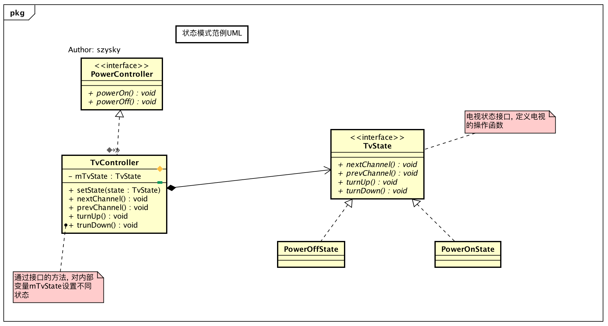

> 对于设计模式这是牛人们对代码中的一定场景而进行提炼的结果, 对于一个进阶的开发人员这是一个必不可少的技能. 当代码越写越好, 更易扩展更加灵活. 这对于Coder来说是最酷的事情.

> 通过`设计模式`和`Android源码`中的关系, 可以更加清楚的记住各个模式的特点, 和源码中的实现方式. **多练多分析之间的关系**这是必不可少的一步!


* [设计模式与Android(篇一)](https://github.com/suzeyu1992/repo/tree/master/project/design-pattern/%E7%9E%B0-%E8%AE%BE%E8%AE%A1%E6%A8%A1%E5%BC%8F%E4%B8%8EAndroid(%E7%AF%87%E4%B8%80))  
* [设计模式与Android(篇二)](https://github.com/suzeyu1992/repo/tree/master/project/design-pattern/%E7%9E%B0-%E8%AE%BE%E8%AE%A1%E6%A8%A1%E5%BC%8F%E4%B8%8EAndroid(%E7%AF%87%E4%BA%8C))
* [设计模式与Android(篇三)](https://github.com/suzeyu1992/repo/tree/master/project/design-pattern/%E7%9E%B0-%E8%AE%BE%E8%AE%A1%E6%A8%A1%E5%BC%8F%E4%B8%8EAndroid(%E7%AF%87%E4%B8%89))


文章只是对`设计模式`做一个场景比对, 实现. 和简单说明. 最好可以自己动手代码实现, 分析代码之间的关系, 才能真正的学以致用. 


* [状态模式 State](#1)
   * [模式介绍](#2)
   * [模式范例](#3)
   * [Android源码模式实现](#4)
* [责任链模式](#5) 
   * [模式介绍](#6)
   * [模式范例](#7)
   * [Android源码模式实现](#8) 
* [解释器模式 Interpreter](#9)
   * [模式介绍](#10)
   * [模式范例](#11)
   * [Android源码模式实现](#12) 
* [命令模式 Command](#13)
   * [模式介绍](#14)
   * [模式范例](#15)
   * [Android源码模式实现](#16)  
* [观察者模式 Observer](#17)
   * [模式介绍](#18)
   * [模式范例](#19)
   * [Android源码模式实现](#20) 
* [备忘录模式 Memento](#21)
   * [模式介绍](#22)
   * [模式范例](#23)
   * [Android源码模式实现](#24) 
* [迭代器模式 Iterator](#25)
   * [模式介绍](#25)
   * [模式范例](#26)
   * [Android源码模式实现](#28) 
* [模板模式 Template](#29)
   * [模式介绍](#30)
   * [模式范例](#31)
   * [Android源码模式实现](#32) 
* [访问者模式 Visitor](#33)
   * [模式介绍](#34)
   * [模式范例](#35)
   * [Android源码模式实现](#36) 


    
  <a name="1"/>  
### 状态模式 State

  <a name="2"/>  
#### 模式介绍

> 状态模式中的行为是由状态来决定的, 不同的状态有不同的行为, 状态模式和策略模式的结构几乎一模一样, 但他们的目的, 本质却完全不一样. 状态模式的行为是平行的不可替换的. 策略模式的行为是彼此独立, 可相互替换的. 总结一句话表述: 状态模式是把对象的行为包装在不同的状态对象里, 每一个状态对象都有一个共同的抽象状态基类, 状态模式的意图是让一个对象在其内部状态改变的时候, 其行为也随之改变

* `定义`: 当一个对象的内在状态改变时允许改变其行为, 这个对象看起来像是改变了其类. 
* `场景`: 
    1. 一个代码的行为取决于它的装填, 并且必须在运行时根据其状态改变它的行为
    2. 代码中包含大量与对象状态有关的条件语句, 同样可以去除分支语句的效果

  <a name="3"/>      
#### 模式范例

例如电视开关机状态下的**频道切换**或者**音量调节**, 不同的状态下的各种功能行为是不同的. `关机`: 功能音量频道切换是无效的, `开机`: 却可以实现. 实现这样一个关系, 如果最简单暴力的方法就是一个类实现, 里面充斥了各种条件判断来实现不同场景的功能. 

[范例代码实现](https://github.com/suzeyu1992/AlgorithmTraining/tree/master/src/design/state) 

范例类图: 



客户端的实现:


```java
public static void main(String arg[]){
        TvController tvController = new TvController();

        // 开机
        tvController.powerOn();

        // 下一个频道
        tvController.nextChannel();

        // 调高音量
        tvController.turnUp();

        // 关机
        tvController.powerOff();

        // 关机状态下调低音量
        tvController.turnDown();
}

/** 输出结果-->
 *  开机了--
 *  下一个频道
 *  调高音量
 *  关机了--
**/
```
其实有多重行为, 但代码中却不存在了`条件分支语句`

 <a name="4"/>  
#### Android源码对相应实现

`WiFi`管理  其中的实现就使用了`状态模式`

在`WiFi`复杂的调用中, 存在一个`State`的状态类, 它代表了`WiFi`的某个状态, 定义如下:


```java
public class State implements IState {
    // 进入当前状态之后调用该函数
    @Override
    public void enter() {
    }
    
    // 退出该状态后改用该函数
    @Override
    public void exit() {
    }  
    
    // 处理消息
    @Override
    public boolean processMessage(Message msg) {
        return false;
    }      
}
```

状态之间并不是可以随意切换的, 他们有一种层级关系, 这些层级关系`StateMachine`的构造函数中被定义的, 代码如下:


```java
// WiFiStateMachine
public WifiStateMachine(Context context, String wlanInterface,
            WifiTrafficPoller trafficPoller){
        super("WifiStateMachine");
        
        addState(mDefaultState);
        addState(mInitialState, mDefaultState);
        addState(mSupplicantStartingState, mDefaultState);
        addState(mSupplicantStartedState, mDefaultState);
        addState(mDriverStartingState, mSupplicantStartedState);
        addState(mDriverStartedState, mSupplicantStartedState);
        addState(mScanModeState, mDriverStartedState);
        addState(mConnectModeState, mDriverStartedState);
        addState(mL2ConnectedState, mConnectModeState);
        addState(mObtainingIpState, mL2ConnectedState);
        addState(mVerifyingLinkState, mL2ConnectedState);
        addState(mConnectedState, mL2ConnectedState);
        addState(mRoamingState, mL2ConnectedState);
        addState(mDisconnectingState, mConnectModeState);
        addState(mDisconnectedState, mConnectModeState);
        addState(mWpsRunningState, mConnectModeState);
        addState(mWaitForP2pDisableState, mSupplicantStartedState);
        addState(mDriverStoppingState, mSupplicantStartedState);
        addState(mDriverStoppedState, mSupplicantStartedState);
        addState(mSupplicantStoppingState, mDefaultState);
        addState(mSoftApStartingState, mDefaultState);
        addState(mSoftApStartedState, mDefaultState);
        addState(mTetheringState, mSoftApStartedState);
        addState(mTetheredState, mSoftApStartedState);
        addState(mUntetheringState, mSoftApStartedState);
        // 初始化模式为mInitialState
        setInitialState(mInitialState);
}
```

在构造函数中调用了`addState()`函数, 这些函数最终会调用`SmHandler#addState()`函数. 这个函数就是在状态之间建立一个层级关系, 这是一个树形的层级关系. 状态之间并不是跨越式的转换, 当前状态只能转换到上一个状态或者下一个状态. 

上面说的比较抽象, 列举书中的例子.  一个电梯的状态有`停止`, `运行`, `开门`, `关门`. 在运行状态只能到停止状态. 不会直接开门状态,这会出人命的, 关门状态也是不合乎常理的. 所以就如下关系图片:


正如上图, 不同状态对于不同的指令的反应是完全不一样的, `WiFi`工作状态机制也是同理, 除了对状态之间的转换进行控制之外, 还通过状态模式来对不同的命令进行不同的处理. `State`类就是状态的基类, 它与`Wifi`相关的子类都定义在`WifiStateMachine`中. 

`State`的类有`enter`,`exit`,`processMessage`三个函数, 进入状态之后会调用`enter()`, 退出时调用`exit()`, 处理具体消息时调用`processMessage()`. 而`状态模式的核心就是当一个对象的内在状态改变时允许改变其行为`, 所以我们关注`processMessage()`不同的状态下就是依赖这个函数实现不同行为的. 

例如: 在请求扫描Wifi时, 如果在`初始化状态(InitialState)`下, 说明Wifi驱动还没有进行加载和启动, 扫描的请求会被会被忽略.  而在`驱动加载状态下`, 请求会被添加到延迟处理的消息队列中, 等待驱动加载完毕进行扫描请求. 

总结起来: 就是将请求的处理封装到状态类中, 在不同的状态类中对同一个请求进行不同的处理. 它能够消除一些重复的`if-else`逻辑, 使得程序的结构更加清晰, 可扩展性和稳定性也有了一定的提高

#### 实战场景

例如新浪微博首页, 任何状态下可以看微博, 当点击转发后, 如果是`登录状态`那么就可以直接调转转发页面, 如果是`未登录状态`那么需要调转到登录界面. 这就可以使用状态模式进行逻辑的分离. 


  <a name="5"/>  
### 责任链模式

  <a name="6"/>  
#### 模式介绍

> 行为型设计模式, 将每一个对象看做一个节点, 并把所有节点串成一条链式, 从链头开始传递事件, 如果无法处理交给节点的下一个节点位置上, 直到有节点处理了这个事件. 

* `定义`: 使多个对象都有机会处理请求, 从而避免了请求的发送者和接收者之间的耦合关系. 将这些对象连成一条链, 并沿着这条链传递该请求, 直到对象处理它为止
* `场景`: 多个对象都可以处理一个请求时, 但具体由哪个对象处理是在运行时决定. 

  <a name="7"/>  
#### 模式范例

出差是需要经费的, 那么肯定需要找领导签字才会批下钱, 但是如果经费较多, 你的上一级可能无权签字,这个时候上一级领导就会把这个审批带向他的上级提交..  直到有可以批准的为止.  从始至终出差人只需要知道自己的上一级即可. 不需要知道其他的审批人. 

[范例代码](https://github.com/suzeyu1992/AlgorithmTraining/tree/master/src/design/iterator)

范例类图


看一下客户端的调用-->


```java
public static void main(String args[]){

        // 构造3个处理者对象
        Handler1 handler1 = new Handler1();
        Handler2 handler2 = new Handler2();
        Handler3 handler3 = new Handler3();

        // 构造3个请求者对象
        Request1 re1 = new Request1("请求1");
        Request2 re2 = new Request2("请求2");
        Request3 re3 = new Request3("请求3");

        // 设置当前处理者对象下一个节点的处理者对象
        handler1.nextHandler = handler2;
        handler2.nextHandler = handler3;

        // 准备开始请求
        // 总是从链式的首端发起请求
        handler1.handleRequest(re1);
        handler1.handleRequest(re2);
        handler1.handleRequest(re3);
}


// 执行结果===================> 
处理者 1 处理请求, 请求的等级为: 1
处理者 2 处理请求, 请求的等级为: 2
处理者 3 处理请求, 请求的等级为: 3
```

对于每个处理者其内部的逻辑是完全灵活的, 比如可以进行跳级传递等...

  <a name="8"/>  
#### Android源码对应实现

责任链模式在`Android`中比较类似的就是事件的分发处理, 每当用户接触屏幕时, `Android`就会将对应的事件包装成一个事件对象从`ViewTree`的顶部之上而下地分发传递. 

`ViewGroup`事件投递的递归调用就类似一条责任链, 一旦其寻到责任者, 那么就由责任者持有并消费掉该次事件 具体的体现在`View#onTouchEvent()`方法返回值的设置, 如果返回false, 那么就意味着当前`View`不会是该次事件的责任人, 将不会对其持有, 如果返回`true`, 则相反, 此时`View`会持有该事件并不在向外传递.

  <a name="9"/>  
### 解释器模式 Interpreter


  <a name="10"/>  
#### 模式介绍

> 这是较少使用的行为型模式, 其提供了一种解释语言的语法或表达式的方式, 该模式定义了一个表达式接口, 通过该接口解释一个特定的上下文. 

* `定义`: 给定一个语言, 定义它的文法的一种表示, 并定义一个解释器, 该解释器使用该表示来解释语言中的句子. 
    * 文法? 如`他很高`,`他很胖`,`他很瘦`. 这三个语句可以看做一个`他很[形容词]`这样的结构, 可以看做是一条文法
* `场景`:
    1. 如果某个简单的语言需要解释执行而且可以将该语言中的语句表示为一个抽象语法树时可以考虑使用解释器模式
    2. 在某些特定的领域出现不断重复的问题时, 可以将该领域的问题转化为一种语法规则下的语句, 然后构建解释器来解释该语句.

  <a name="11"/>  
#### 模式范例

不好理解看看是通过代码形式的表示是否可以清楚一些?

比如一个场景是算术表达式的解释, 如`m + n + p`, 如果使用解释器模式对该表达式进行解释, 那么代表数字的`mnp`3个字母我们可以看成是`终结符号`, 而`+`这个算术运算符则可以当做非终结符号. 

[代码范例](https://github.com/suzeyu1992/AlgorithmTraining/tree/master/src/design/interpreter)

如最终调用方式:


```java
public static void main(String arg[]){
   Calculator calculator = new Calculator("12 + 11 + 13 + 14");
   System.out.println(calculator.calculate());
}

// 结果如下:
50
```

这个例子只是先了对加减法的解释计算, 如果要实现更多的运算规则, 乘除取余, 只需要创建对应解释器即可, 但是混合运算的复杂是要考虑各种符号的优先级的问题,这个就比较麻烦.

将一个具体的文法通过一个解释器解释, 把复杂的文法规则分离为简单的功能进行解释, 最后将其组合成一颗抽象的语法树解释执行, 至此, 可以看到解释器模式的原理和本质: 将复杂的问题简单化, 模块化, 分离实现, 解释执行


  <a name="12"/>  
#### Android源码对应实现

`Android源码中`的解释器模式并不多见, 虽然没有经典实现, 但是可以在一些地方看到对解释器模式原理的应用. `AndroidManifest.xml`这个清单文件

整理一下大体过程. 关于读取配置文件, 那么就需要一个很重要的类`PackageParser`. 该类对`AndroidManifest.xml`中每一个组件标签创建了对应的类, 用于存储相应的消息. 

`PackageParser`为`Activity`,`Service`,`Provider`,`Permission`等构件在其内部以内部类的方式创建了对应的类, 按照解释器模式的定义, 这些类其实都对应`AndroidManifest.xml`中的一个标签, 也就是一条文法, 其在对该配置文件解析时充分运用了解释器模式分离实现, 解释器执行的特性.

对一个`APK`文件的解析会调用`PackageManagerService#scanPackageLI()`方法, 这个方法有两种实现


```java
private PackageParser.Package scanPackageLI(File scanFile, int parseFlags, int scanFlags,long currentTime, UserHandle user);
 
private PackageParser.Package scanPackageLI(PackageParser.Package pkg, int parseFlags,int scanFlags, long currentTime, UserHandle user) 
```

两者的唯一区别是第一个参数, 第一种实现为`File`第二种为`PackageParser.Package`. 在具体解析某个文件时会先调用第一种实现解析`apk`文件, 在调用第二种实现将解析后的信息保存至`PMS`中.  而这两种方法中同样会调用一个函数名相同但参数不同的函数. `ParserPackage(...)`. 对于参数1为`File`类型的其中主要逻辑就是为了第二种`参数为Resources`实现准备好需要的参数, 然后可以调用第二种`ParserPackage(Resource ...)`.

而`ParserPackage`的第二种实现逻辑比较复杂, 内部主要对整个`AndroidManifest.xml`配置文件的每个子节点进行具体的解析. 

例如`parseApplication`方法的会对`application`节点进行解析,  对于不同的子标签会调用不同的解析方法来对其内部进行解析. 如碰到了`activity`标签, 那么会调用`parseActivity()`进行内部解析. 而`parseActivity()`不仅承担着对`Activity`的解析, 其同样承担着`Broadcast`的解析. 并会继续调用方法对内部标签进行解析如`parseIntent`和`parseMetaData`等. 


  <a name="13"/>  
### 命令模式 Command

  <a name="14"/>  
#### 模式介绍

> 行为型设计模式, 如当我们点击关机键的时候, 系统就会执行一系列的操作, 保存程序的进度, 结束程序, 调用内核命令关机. 用户不关心命令做了什么, 只需要点击关机即可达到效果.

* `定义`: 将一个请求封装成一个对象, 从而让用户使用不同的请求把客户端参数化; 对请求排队或者记录请求日志, 以及支持可撤销操作.
* `场景`: 
    * 需要抽象出待执行的操作, 然后以参数的形式提供出来-- 类似于过程设计中的回调机制, 而命令模式正式回调机制的一个面向对象的替代品
    * 在不同的时刻指定, 排列和执行请求. 一个命令对象可以有与初始请求无关的生存期
    * 需要支持取消操作
    * 支持修改日志的功能, 这样当系统崩溃的时候, 这些修改可以重做一遍
    * 需要支持事务的操作


  <a name="15"/>  
#### 模式范例

把俄罗斯方块的大体逻辑模拟成代码, 向左,向右,变形,加速下落这四个按钮相当于`请求者`, 执行具体按钮命令的逻辑方法可以看做是命令角色. 

[范例代码](https://github.com/suzeyu1992/AlgorithmTraining/tree/master/src/design/command)

范例类图


代码测试


```java
public static void main(String arg[]){

   // 创建游戏
   TetrisMachine machine = new TetrisMachine();

   // 根据游戏构造四个命令
   LeftCommand leftCommand = new LeftCommand(machine);
   RightCommand rightCommand = new RightCommand(machine);
   FastCommand fastCommand = new FastCommand(machine);
   TransformCommand transformCommand = new TransformCommand(machine);

   // 按钮可以执行不同的命令
   Buttons buttons = new Buttons();
   buttons.setmLeftCom(leftCommand);
   buttons.setmRightCom(rightCommand);
   buttons.setmFastCom(fastCommand);
   buttons.setmTransformCom(transformCommand);

   // 具体按下那个按钮玩家说的算
   buttons.toLeft();
   buttons.toRight();
   buttons.fast();
   buttons.transform();
}
```

其实调用逻辑做的很复杂, 完全可以直接创建`TetrisMachine`类直接调用的. 这样做的主要原因是后续开发方便, 比如如果需要增加或修改游戏功能只需要修改`TetrisMachine`类就可以. 然后修改一下`Player`类. 但是事物是相对的对开发者方便了, 但是如果别人负责了这个项目看到这个功能可能会花更多时间去理解,反而简单的事情没有很直接的表达. 

除此之外, 使用命令模式的另一个好处是可以实现命令记录的功能, 如上面代码中, 如果要`Button`请求者角色中使用一个数据结构来存储执行过的命令对象, 以此可以很方便地知道刚刚执行过哪些命令动作, 并可以在需要时恢复

  <a name="16"/>  
#### Android源码对应实现

`Android`中关于命令模式的使用虽然不少, 但都不是典型, 很多方面的应用与其他大多数设计模式一样都有一定的变种, 一个比较经典的例子是`Android的事件机制中底层逻辑对事件的转发处理`, `Android`的每一种事件在屏幕上产生后都会经过底层逻辑将其封装转换为一个`NotifiArgs`对象.

#### 实战场景

很好的一个场景就是, 对画板模块的使用, 可以很方便的实现重画,撤销等功能. 


  <a name="17"/>  
### 观察者模式 Observer

  <a name="18"/>  
#### 模式介绍

> 一个使用率非常高的模式, 常用的地方GUI系统, 订阅--发布系统. 最明显的特点就是解耦, 将被观察者和观察者进行解耦, 使得依赖性更小. 

* `定义`: 定义对象间一种一对多的依赖关系,使得每当一个对象改变状态, 则所有依赖于它的对象都会得到通知并被自动更新. 
* `场景`: 
    * 关联行为场景, 需要注意的是, 关联行为是可拆分的, 而不是`组合`的关系
    * 事件多级触发场景
    * 跨系统的消息交换场景, 如消息队列,事件总线的处理机制
   
<a name="19"/>   
#### 模式范例

例如一个简单的订阅, 订阅者可以在被观察者更新的时候收到通知. 

[范例源码](https://github.com/suzeyu1992/AlgorithmTraining/tree/master/src/design/observer)

类图就不需要了, 因为`JDK`已经内置了此模式的实现, 看一下范例的调用方式和结果


```java
public  static void main(String arg[]){
   // 创建被观察对象
   DecTechFrontier decTechFrontier = new DecTechFrontier();

   // 创建几个观察者
   Coder co1 = new Coder("张飞");
   Coder co2 = new Coder("李逵");
   Coder co3 = new Coder("关羽");
   Coder co4 = new Coder("孙悟空");

   // 将观察者注册到被观察的对象
   decTechFrontier.addObserver(co1);
   decTechFrontier.addObserver(co2);
   decTechFrontier.addObserver(co4);
   decTechFrontier.addObserver(co3);

   // 发布消息
   decTechFrontier.postNewPublication("葵花宝典");
}
// =====> 输出结果
你好, 关羽, 你订阅的东西有更新了: 葵花宝典 
你好, 孙悟空, 你订阅的东西有更新了: 葵花宝典 
你好, 李逵, 你订阅的东西有更新了: 葵花宝典 
你好, 张飞, 你订阅的东西有更新了: 葵花宝典 

```

`Observer`和`Observable`是`JDK`中的内置类型, 可见观察者模式是非常重要的, 这里`Observer`是抽象观察者角色, `范例Coder`类扮演的是具体观察者角色; `Observable`对应的是抽象主题角色, `范例DecTechFrontier`是具体的主题角色. `主题角色`通过`setChange()`标识主题发生改变,并通过`notifyObservable()`通知所有的`观察者角色`. 而`观察者`都过复写`update()`方法来实现主题更新时需要做的事情 . 至此这两个角色并没有耦合. 


  <a name="20"/>  
#### Android源码对应实现

`ListView`中的`Adapter#notifyDataSetChange()`就是通过观察者模式实现的子View的更新. 

首先是`notifyDataSetChange()`方法为入口. 这个方法定义在`BaseAdapter`中. 


```java
public abstract class BaseAdapter implements ListAdapter, SpinnerAdapter {
    // 数据集观察者
    private final DataSetObservable mDataSetObservable = new DataSetObservable();
    public void registerDataSetObserver(DataSetObserver observer) {
        mDataSetObservable.registerObserver(observer);
    }

    public void unregisterDataSetObserver(DataSetObserver observer) {
        mDataSetObservable.unregisterObserver(observer);
    }
    
    /**
     * 数据发生改变是, 调用所有观察者
    **/
    public void notifyDataSetChanged() {
        mDataSetObservable.notifyChanged();
    }

}
```

很明显的`BaseAdapter`是一个观察者模式, 那么接着看一下如何运作, 以及这个观察者是什么. 


```java
public class DataSetObservable extends Observable<DataSetObserver> {
    // 调用每个观察者的onChange函数来通知他们被观察者发生了改变
    public void notifyChanged() {
        synchronized(mObservers) {
            // 调用所有的观察者onChange()
            for (int i = mObservers.size() - 1; i >= 0; i--) {
                mObservers.get(i).onChanged();
            }
        }
    }
}
```

可以看到我们调用的`notifyDataSetChanged()`会遍历所有的观察者中的`onChange()`. 

这些观察者就是在`ListView`通过`setAdapter()`方法设置`Adapter`产生的.


```java
@Override
public void setAdapter(ListAdapter adapter) {
   // 如果已经有了一个Adapter, 那么先注销该Adapter对应的观察者
   if (mAdapter != null && mDataSetObserver != null) {
           mAdapter.unregisterDataSetObserver(mDataSetObserver);
       }
   super.setAdapter(adapter);

   if (mAdapter != null) {
       mAreAllItemsSelectable = mAdapter.areAllItemsEnabled();
       mOldItemCount = mItemCount;
       // 获取数据的数量
       mItemCount = mAdapter.getCount();
       checkFocus();
       // *** 创建一个数据集观察者
       mDataSetObserver = new AdapterDataSetObserver();
       // 将这个观察者注册到Adapter中, 实际上注册到了 DataSetObservable中
       mAdapter.registerDataSetObserver(mDataSetObserver);

   }
   
   requestLayout();
}
```

可以看出, 在设置`Adapter`时会构建一个`AdapterDataSetObserver`, 这就是之前说的观察者, 最后将这个观察者注册到`Adapter`中

那么`AdapterDataSetObserver`是什么? 是如何运作的? 首先这个这个类定义在了`ListView`的父类`AbsListView`中, 而这个类又继承了`AbsListView`的父类`AdapterView的AdapterDataSetObserver`.如下


```java
class AdapterDataSetObserver extends DataSetObserver {

   private Parcelable mInstanceState = null;

   // 核心方法
   @Override
   public void onChanged() {
       mDataChanged = true;
       mOldItemCount = mItemCount;
       // 获取adapter的数量
       mItemCount = getAdapter().getCount();

       if (AdapterView.this.getAdapter().hasStableIds() && mInstanceState != null
               && mOldItemCount == 0 && mItemCount > 0) {
           AdapterView.this.onRestoreInstanceState(mInstanceState);
           mInstanceState = null;
       } else {
           rememberSyncState();
       }
       checkFocus();
       // 重新布局
       requestLayout();
   }
}
```

这回应该很清楚了, 当`ListView`的数据发生变化时, 调用了`Adapter#notifyDataSetChanged()`函数, 这个函数又会调用`DataSetObserver#notifyChange()`函数, 这个函数会遍历所有的观察者`AdapterDataSetObserver#onChange()` 在`onChange()`方法中又会调用`ListView`重新布局, 使得`ListView`刷新界面


#### 实战场景

事件总线!


  <a name="21"/>  
### 备忘录模式 Memento


  <a name="22"/>  
#### 模式介绍

> 一种行为模式, 该模式用于保存对象, 并且在之后可以再次恢复到此状态

* `定义`: 在不破坏封闭的前提下, 捕获一个对象的内部状态,并在该对象之外保存这个状态, 以后就可将该对象恢复到原先保存的状态.
* `场景`: 
    1. 需要保存一个对象在某一个时刻的状态或部分状态
    2. 如果用一个接口来让其他对象得到这些状态, 将会暴露对象的实现细节并破坏对象的封装性, 一个对象不希望外界直接访问其内部状态, 通过中间对象可以间接访问其内部状态.


  <a name="23"/>  
#### 模式范例

比如一个游戏, 在退出时候保存进度, 在进入的时候恢复进度的场景

[范例源码](https://github.com/suzeyu1992/AlgorithmTraining/tree/master/src/design/memento)

范例类图


范例的使用-->


```java
public static void main(String arg[]){

   // 构建游戏对象
   CallOfDuty game = new CallOfDuty();

   // 1 打游戏
   game.play();

   Caretaker caretaker = new Caretaker();
   // 2 游戏存档
   caretaker.archive(game.createMemo());

   // 3 退出游戏
   game.quit();

   // 4 恢复游戏
   CallOfDuty newGame = new CallOfDuty();
   newGame.restore(caretaker.getMemo());
}

// =======> 运行结果
玩游戏: 第1关 奋战杀敌中
进度升级中
到达 第2关
-----
退出前的游戏属性: 当前游戏信息: checkpoint=2 ,mLifeValue=90 ,mWeapon=沙漠之鹰
退出游戏
-----
恢复后的游戏属性--> 当前游戏信息: checkpoint=2 ,mLifeValue=90 ,mWeapon=沙漠之鹰
```

可以看到`CallOfDuty`在这里为`Originator`角色, 也就是需要存储的对象, 在这里并没有直接存储对象, 而是通过`Memo`对`CallOfDuty`对象的数据进行存储, 然后在存储`Memo`对象, 最终对`Memo`的存储操作交给`Caretaker`对象. 在这个过程中, 各个角色职责清晰, 单一, 即对外屏蔽了对`CallOfDuty`角色的直接访问, 在满足了对象状态存取功能的同时也使得该模块的结构清晰, 整洁.


  <a name="24"/>  
#### Android源码对应实现

在`Android`源码中的状态模式应用是`Activity`中的状态保存. 

在这里, `Activity`扮演了`Caretaker`角色, 负责存储和恢复UI的状态信息; `Activity`,`Fragment`,`View`,`ViewGroup`等对象为`Originator`角色, 也就是需要存储状态的角色. `Memo`则由`Bundle`类扮演. 


  <a name="25"/>  
### 迭代器模式 Iterator

  <a name="26"/>  
#### 模式介绍

> 也成为游标模式, 行为性设计模式. 源于对容器的访问.

* `定义`: 提供了一种方法顺序访问一个容器对象中的各个元素, 而不需要暴露该对象的内部表示
* `场景`: 遍历一个容器对象

  <a name="27"/>  
#### 模式实现

场景: 如两个部门, 老板想要对两个部门的统计数据, 但是如果两个部门的内部实现存储如果是一个用数组, 一个集合, 那么老板访问就需要了解其内部的数据结构. 使得老板的职责过多, 这个时候如果用迭代器模式实现,统一遍历方式, 那么就会很方便,也不会对外暴露内部的实现细节. 如下:

[范例代码](https://github.com/suzeyu1992/AlgorithmTraining/tree/master/src/design/cursor)


使用情况:


```java
public static void main(String args[]){
   CompanSu companSu = new CompanSu();
   check(companSu.iterator());

   CompanLi companLi = new CompanLi();
   check(companLi.iterator());
}

private static void check(Iterator iterator) {
   while (iterator.hasNext()){
       System.out.println(iterator.next().toString());
   }
}

// ======> 结果
Employee{name='小敏', age=99, sex='男', position='程序员'}
Employee{name='小李', age=98, sex='男', position='程序员'}
Employee{name='小往', age=11, sex='女', position='程序员'}
Employee{name='小爱', age=9, sex='女', position='程序员'}
Employee{name='大敏', age=66, sex='妖', position='未知'}
Employee{name='大李', age=66, sex='妖', position='未知'}
```

这个例子只是列举个思想, 可以看到通过迭代器实现, 就可以对外通过一个统一的接口, 来对不同的内部细节不一样的容器进行访问. 这也是`List`,`Map`都实现迭代器的意义. 


  <a name="28"/>  
#### Android源码对应实现

几乎开发者不会自己去实现一个迭代器, 例如`Android`中, 除了各种数据结构体, 最典型的就是数据库查询使用了`Cursor`. 当使用`SQLiteDatabase#query()`方法查询数据时, 会返回一个`Cursor`对象. 该对象实质就是一个迭代器. 

所以可以看出迭代器模式, 特点很明显也很单一, 支持以不同的方式去遍历一个容器对象, 也可以有多个遍历, 弱化了容器与遍历算法之间的关系. 几乎每一种高级语言都有对应的内置迭代器实现.


  <a name="29"/>  
### 模板模式 Template

  <a name="30"/>  
#### 模式介绍

> 某一个算法所需要的关键步骤是已知的, 但是某一步的具体实现是未知的需要子类去实现

* `定义`: 定义一个操作中的算法框架, 而将一些步骤延迟到子类中, 使得子类可以不改变一个算法的结构即可重定义该算法的某些步骤.
* `场景`:
    * 多个子类有共有的方法, 并且逻辑基本相同
    * 重要, 复杂的算法, 可以把核心算法设计为模板方法, 周边的相关细节由子类去实现
    * 重构时, 模板方法模式是一个经常使用的模式, 把相同的代码抽取到父类, 然后通过钩子函数约束其行为

  <a name="31"/>  
#### 模式范例

模板方式实际上是封装一个固定流程, 然后暴露某一个步骤方法, 这里以计算机开机为例子, 

[范例代码](https://github.com/suzeyu1992/AlgorithmTraining/tree/master/src/design/template) 


代码使用:


```java
public static void main(String arg[]){

   CodeComputer codeComputer = new CodeComputer();
   codeComputer.startUp();

   MilitaryComputer militaryComputer = new MilitaryComputer();
   militaryComputer.startUp();
}

// ========> 运行结果
--------- 开机 start -----------
开启电源
硬件检测
载入操作系统
需要密码
---------- 关机 end ---------------
--------- 开机 start -----------
开启电源
硬件检测
>> 需要检测防火墙
载入操作系统
需要进行眼膜验证
---------- 关机 end ---------------
```

上面代码不管什么情况四个步骤是必须的, 开启电源是刚需,不需要子类实现, `startUp()`设置方法是`final`因为调用流程是必须的. 而其余的方法根据不同的需求来进行改造. 

  <a name="32"/>  
#### Android源码对应实现

`Android`中`AsyncTask`就是一个比较明显的模板方法模式. 

其内部调用顺序就是 `execute`-->`onPreExecute`-->`doInBackground`-->`onPostExecute`

或者比如`Activity`的声明周期方法. 


  <a name="33"/>  
### 访问者模式 Visitor


  <a name="34"/>  
#### 模式介绍

> 访问者模式是一种将数据操作与数据结构分离的设计模式,它是23种设计模式最复杂的一个, 但使用率不高. 大体思想, 软件系统中拥有一个由许多对象构成的, 比较稳定的对象结构, 这些对象的类都拥有一个`accept`方法用来接收访问者对象的访问. 访问者是一个接口, 他拥有`visit`方法, 这个方法对访问到的对象结构中不同的类型元素做出不同的处理. 

* `定义`: 封装一些作用于某种数据结构中的各个元素的操作, 它可以在不改变这个数据结构的前提下定义作用于这些元素的新的操作
* `场景`: 
    * 对象结构比较稳定, 但经常需要在此对象结构上定义新的操作
    * 需要对一个对象结构中的对象进行很多不同的并且不相关的操作, 而需要避免这些操作污染这些对象的类, 也不希望在增加新操作时修改这些类
  
<a name="35"/>     
#### 模式范例

场景: 公司的年度考核, 评定员工分别是`CEO`和`CTO`, 而`CEO`只关注工程师的代码量和经理的新产品数; `CTO`关注的是工程师的`KPI`和经理的`KPI`. 这时`CEO`和`CTO`对于不同员工的关注点是不一样的. 这就需要对不同的员工类型进行不同的处理. 访问者模式此时可以派上用场了.

[范例代码](https://github.com/suzeyu1992/AlgorithmTraining/tree/master/src/design/visitor)

代码使用结果:


```java
public static void main(String args[]){
   // 构建报表
   BusinessReport report = new BusinessReport();

   System.out.println("----------给CEO看的报表----------");
   // 设置访问者, 这里是CEO
   report.showReport(new CEOVisitor());

   System.out.println("----------给CTO看的报表----------");
   // 注入另一访问者CTO
   report.showReport(new CTOVisitor());
}
// ======> 结果
----------给CEO看的报表----------
CEO访问--> 经理王经理 . KPI : 9 , 新产品数量: 0
CEO访问--> 工程师工程师-jake . KPI : 2
CEO访问--> 工程师工程师-小李 . KPI : 5
CEO访问--> 工程师工程师-小张 . KPI : 0
----------给CTO看的报表----------
CTO访问--> 经理 王经理 , 新产品数量: 0
CTO访问--> 工程师 工程师-jake . 代码行数 : 14290
CTO访问--> 工程师 工程师-小李 . 代码行数 : 2183
CTO访问--> 工程师 工程师-小张 . 代码行数 : 83422
```


范例中`Staff`扮演了`Element`角色, 而`Enginner`和`Manager`都是`ConcreteElement`; `CEOVisitor`和`CTOVistor`都是具体的`Vistor`对象, 而`BusinessReport`就是`ObjectStructure`; `Client`就是客户端

访问者最大的优点就是增加访问者非常容易, 如果要增加一个访问者, 只需要创建一个实现了`Visitor`接口的类, 然后实现两个`visi`函数来对不同的元素进行不同的操作, 从而达到数据对象与数据操作相分离的效果. 

  <a name="36"/>  
  
#### Android源码对应实现

`APT`的注解. 简单记录一下. 首先编译器将代码抽象成一个代码元素的树, 然后在编译时对整棵树进行遍历访问, 每个元素都有一个`accept()`接收访问者的访问, 每个访问者中都有对应的`visit()`函数, 例如`visitType()`函数就是对类型元素的访问, 在每个`visit`函数中对不同的类型进行不同的处理, 这样就达到了差异处理效果, 同时将数据结构与数据操作分离, 使得每个类型的职责单一, 易于升级维护. `JDK`还特意预留了`visitUnknown()`接口应对`Java`语言后续发展可能添加的元素类型问题, 灵活的将访问者模式的缺点化解.

