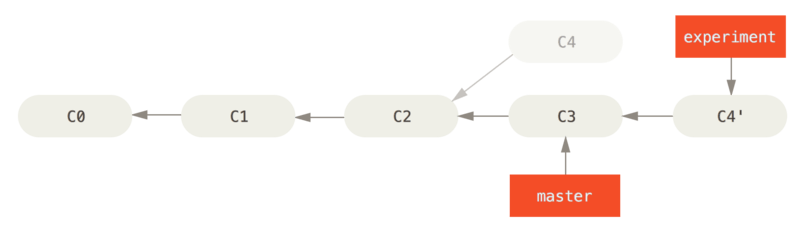

> Git再识 拥抱开始
>   这些应该可以让你对Git的使用更进一步  ^*^


* [安装Git](#安装git)
* [配置文件](#配置文件)
    * [查看config](#查看config)
    * [设置用户信息](#设置用户信息)
    * [Git别名](#git别名)
    * [.gitignore文件](#gitignore文件)
* [仓库的基础操作](#仓库的基础操作)
    * [初始化仓库](#初始化仓库)
    * [添加文件到暂存区](#添加文件到暂存区)
    * [status仓库](#status仓库)
    * [diff仓库](#diff仓库)
    * [提交更新](#提交更新)
    * [移除文件](#移除文件)
    * [移动文件](#移动文件)
    * [查看历史提交](#查看历史提交)
    * [撤销操作](#撤销操作)
    * [标签](#标签)
* [分支操作](#分支操作)
    * [分支的创建](#分支的创建)
    * [分支的切换](#分支的切换)
    * [分支合并](#分支合并)
    * [删除分支](#删除分支)
    * [分支管理](#分支管理)
    * [变基](#变基)
    * [远程分支](#远程分支)
    * [跟踪分支](#跟踪分支)
* [远程仓库操作](#远程仓库操作)
    * [克隆仓库](#克隆仓库)
    * [查看远程仓库](#查看远程仓库)
    * [添加远程仓库](#添加远程仓库)
    * [远程仓库的拉取推送](#远程仓库的拉取推送)
    * [远程仓库移除重命名](#远程仓库移除重命名)


<span id = "安装Git"></span>
## 安装Git

**Linux**

`$ sudo yum install git`

或者

`$ sudo apt-get install git`

**Mac**

直接在`Terminal`执行`git`命令, 如果没有会提示安装方法.

如果喜欢安装程序的话, [点这里](http://git-scm.com/download/mac)
<span id = "配置文件"></span>
## 配置文件

第一次安装, 千万别要忘了配置你的git的使用者名字和邮箱.  这个道理很简单, 每一次的提交时需要记录提交者的, 如果没有提交者, 那么bug出现找谁来背锅??

<span id = "查看config"></span>
### 查看config

Git 自带一个 git config 的工具来帮助设置控制 Git 外观和行为的配置变量。

**`/etc/gitconfig` 文件: 包含系统上每一个用户及他们仓库的通用配置。**

`$ git config --system --list`

---

**`~/.gitconfig` 或 `~/.config/git/config` 文件：只针对当前用户。**

`$ git config --global --list`

---


当前使用仓库的 Git 目录中的 config 文件（就是 `.git/config`）：针对该仓库。

每一个级别覆盖上一级别的配置，所以`.git/config`的配置变量会覆盖`/etc/gitconfig`中的配置变量。

---

**当然, 也可以查看某一项配置信息.**

* 形式:`git config [--global|--system] <key>`

*查看最终的配置属性值*
`$ git config user.name`  

*查看当前系统的属性值*
`$ git config --global user.name`   


---
<span id = "设置用户信息"></span>
### 设置用户信息

`$ git config --global user.name "name"`

`$ git config --global user.email xxx@163.com`

使用`--global`选项, 当以后在该系统上做的任何操作都会使用此属性. 如果你需要在某一个特定的项目使用其他名字和邮箱, 那么可以通过设置**项目中的config文件**, 这样config中的属性会覆盖掉**global的全局属性**, 并且当在其他项目中并不会造成影响. 使用方式只需要去掉`--global`参数即可修改项目中的`.git/config`文件

`$ git config user.name "name"`


---

**获取帮助手册**

形式: `git help <verb>` 或者 `git <verb> --help`

比如查看config手册

`$ git help config`
<span id = "Git别名"></span>
### Git别名

例如: 生成别名之后可以在日后用简短的表示来使用

```
$ git config --global alias.br branch
$ git config --global alias.ci commit
$ git config --global alias.st status
```

<span id = "gitignore文件"></span>
### .gitignore文件

对于自动生成的文件, 日志, 编译的临时文件等. 可以对其进行配置, 让git不追踪这些文件

规范如下:

* 所有空行或者以 ＃ 开头的行都会被 Git 忽略。
* 可以使用标准的 glob 模式匹配。
* 匹配模式可以以（/）开头防止递归。
* 匹配模式可以以（/）结尾指定目录。
* 要忽略指定模式以外的文件或目录，可以在模式前加上惊叹号（!）取反

`glob模式`是指shell所使用的简化了的正则表达式.

* `*` :匹配零个或多个任意字符
* `[abc]` :只匹配括号内的任意一个字符
* `[0-9]` :使用短划线表示范围, 可以匹配0到9之间的任何字符.
* `?` :匹配任意一个字符
* `**`:匹配任意的中间目录,例如`a/**/z`可以匹配`a/z`,`a/b/z`,`a/b/c/z`等

如下给出一个样板:


```
# 忽略所有以 .c结尾的文件
*.c

# 但是 stream.c 会被git追踪
!stream.c

# 只忽略当前文件夹下的TODO文件, 不包括其他文件夹下的TODO例如: subdir/TODO
/TODO

# 忽略所有在build文件夹下的文件
build/

# 忽略 doc/notes.txt, 但不包括多层下.txt例如: doc/server/arch.txt
doc/*.txt

# 忽略所有在doc目录下的.pdf文件
doc/**/*.pdf
```

<span id = "仓库的基础操作"></span>
## 仓库的基础操作

<span id = "初始化仓库"></span>
### 初始化仓库


```
$ git init
```


<span id = "添加文件到暂存区"></span>
### 添加文件到暂存区


```
# 添加全部暂存区和历史区不存在的或者有更改的 `.c`结尾的文件
$ git add *.c

# 添加全部暂存区和历史区不存在的或者有更改的文件
$ git add .  

# 指定文件添加
$ git add test.c
```


---

<span id = "status仓库"></span>
### status仓库


```
$ git status

# 如果需要显示一种紧凑式格式
$ git status --short      # 等价于 $ git status -s
```

紧凑式中字母的表示含义如下:

* `??` :表示新添加的未追踪的文件
* ` M` :M出现在右边,表示该文件被修改但是还没有放入暂存区
* `M ` :M出现在左边,表示文件被修改已经放入了暂存区
* `MM` :出现两个,代表此文件在工作区修改已经放入了暂存区, 但之后有进行了修改,没有添加到暂存区


---


<span id = "diff仓库"></span>
### diff仓库

如果你想知道文件具体修改的内容, 那么`diff`会很有用


```
# 查看以追踪但尚未暂存的文件更新了哪些部分, 不添加额外参数
$ git diff

# 对使用了add添加到了暂存区的内容, 使用--staged参数或者--cached
$ git diff --staged

```

<span id = "提交更新"></span>
### 提交更新


```
# 常规做法
$ git commit -m "commit message"

# 如果不使用-m参数添加提交信息, git会使用默认的编译器如vi进行提交描述编写.
# 可通过$ git config --global core.edit 设定喜欢的编译器

# 跳过暂存区操作, 直接从工作区提交到历史区
$ git commit -a -m ""          #等价于: $ git commit -am ""


```

<span id = "移除文件"></span>
### 移除文件

如果在工作区间对一个文件进行删除, 需要先进行`add`,然后才可以提交. 使用`git rm`可以直接在工作区间删除文件, 并提交到暂存区.


```
$ git rm fileName

# 如果文件修改,并添加了暂存区, 需要使用-f参数来强制删除(force)
$ git rm -f fileName

# 可以使用glob模式,如下
$ git rm log/\*.log         # 删除log目录下所有名称是.log结尾文件
$ git rm \*~                # 删除以~结尾的所有文件
```

<span id = "移动文件"></span>
### 移动文件

同样使用`git rm`会方便很多, 并且如果相对文件重命名也可以如此


```
$ git mv file_from file_to
```
当执行了这条语句之后, 只需要在下一次`commit`即可, 不需要考虑额外操作. 等价于如下:

```
$ mv file_from file_to
$ git rm file_from
$ git rm file_to

```

<span id = "查看历史提交"></span>
### 查看历史提交

如果是最基本的`git log`, 那么会按提交时间列出所有更新, 包括提交的SHA-1校验和, 作者名称,邮箱,提交时间,提交说明. 下面说说常用选项.


```
# -p:仅显示最近x次的提交  格式 $ git log -p -x
$ git log -p -2             # 查看最近的两次提交内容


# --stat:简略的显示每次提交的内容更改, 如哪些文件变更,多少删除,多少添加等
$ git log --stat

# --pretty: 指定默认不同格式展示信息
$ git log --pretty=oneline              #每次提交用一行显示

$ git log --pretty=format:"%h - %an, %ar : %s"  
# 效果:1a99c42 - 苏, 19 hours ago : 无意义提交


```
**关于`format`对应的常用占位符的写法和意义**

|选项	|说明|
|---|---|
|%H|提交对象（commit）的完整哈希字串|
|%h|提交对象的简短哈希字串|
|%T|树对象（tree）的完整哈希字串|
|%t|树对象的简短哈希字串|
|%P|父对象（parent）的完整哈希字串|
|%p|父对象的简短哈希字串|
|%an|作者（author）的名字|
|%ae|作者的电子邮件地址|
|%ad|作者修订日期（可以用 --date= 选项定制格式）|
|%ar|作者修订日期，按多久以前的方式显示|
|%cn|提交者(committer)的名字|
|%ce|提交者的电子邮件地址|
|%cd|提交日期|
|%cr|提交日期，按多久以前的方式显示|
|%s|提交说明|

---

**图形展示分支的合并历史**
```
$ git log --graph --oneline   #oneline只是让输出看起来比较舒服
```

---

**git log的一些其他操作**

|选项	|说明|
|---|---|
|-p|按补丁格式显示每个更新之间的差异。|
|--stat|显示每次更新的文件修改统计信息。|
|--shortstat|只显示 --stat 中最后的行数修改添加移除统计。|
|--name-only|仅在提交信息后显示已修改的文件清单。|
|--name-status|显示新增、修改、删除的文件清单。|
|--abbrev-commit|仅显示 SHA-1 的前几个字符，而非所有的 40 个字符。|
|--relative-date|使用较短的相对时间显示（比如，“2 weeks ago”）。|
|--graph|显示 ASCII 图形表示的分支合并历史。|
|--pretty|使用其他格式显示历史提交信息。可用的选项包括 oneline，short，full，fuller 和 format（后跟指定格式）。|


**查找一个字符串的出现和删除的提交**

```
# 使用限制符-S后面紧跟要查询的字符串
$ git log -Smethod_name

# 或者针对一个文件进行更改的提交查询, 只需要在后面追加文件名称即可
$ git log fileName
```

哈哈,即使如果你不小心写个隐藏bug不管几个月之后,如果老大要想找出问题是写引发的其实很简单.例如这样
`$ git log -p fileName` 想甩锅?算了吧,还是认错以后多注意吧.

**还有一些限制log输出的选项**


|选项|	说明|
|---|---|
|-(n)|仅显示最近的 n 条提交|
|--since, --after|仅显示指定时间之后的提交。|
|--until, --before|仅显示指定时间之前的提交。|
|--author|仅显示指定作者相关的提交。|
|--committer|仅显示指定提交者相关的提交。|
|--grep|仅显示含指定关键字的提交|
|-S|仅显示添加或移除了某个关键字的提交|

一个实际的例子，如果要查看 Git 仓库中，2016 年 11 月1号到7号，作者叫苏的提交文件，可以用下面的查询命令：

```
git log --pretty="%h - %s" --author=苏 --since="2016-11-01" \
   --before="2016-11-07"
```

<span id = "撤销操作"></span>
### 撤销操作

**amend重新提交**

当我们`commit`之后突然发现漏掉了一个文件, 这个时候不可能对一个文件再进行`commit`一次, 这样做就显得很多余, 而如果版本回退之前再添加也比较麻烦. 这个时候就可以使用这个`amend`命令.如下:


```
$ git commit -m "版本1.5开发代码"

# 正当你松了一口气的时候发现配置文件忘记修改了, 你赶紧修改,并适合用add到暂存区
$ git add project.property
$ git commit --amend         
# 你会神奇的发现你没有增加任何多余的操作就把漏掉的文件补齐到最后一次提交中
```
---

**取消暂存的文件**

就是对文件进行了`git add`操作. 这个时候可以`reset`


```
# 让暂存区的文件变成文件修改但是没有添加暂存区的状态
$ git reset HEAD fileName
```

**撤销对文件的修改**

场景: 当文件修改了, 但是还没有进行`git add`的时候还只是在工作区间, 还原成最后一次提交的内容


```
$ git checkout -- filename
```
要注意使用, 使用之前确定是否要抛弃已经添加的内容. 因为这个动作可能让你最新添加的内容彻底丢失. 因为没有进行`commit`, 一般来说进行了`commit`的内容都是可以恢复的.


<span id = "标签"></span>
### 标签

>Git可以给历史中的某一个提交打上标签, 以示重要. 比如每次正式版本的上线等.

**列出标签**


```
$ git tag

# 如果你只关心某一部分的标签, 例如只对v2.x的标签感兴趣,你可以这样做
$ git tag -l 'v2.*'
```

---

**创建标签**

标签分为两种一种是`附加标签`另一种是`轻量标签`.

* 附加标签: 会保存打标签者的信息, 时间和附加信息. 最后更随打标签的提交
* 轻量标签: 只是在一个提交上做一个标记. 存储在一个专门保存标签的文件,指向提交的hash值

先来看附加标签:


```
$ git tag -a v1.0 -m '附加信息'
```

轻量标签


```
$ git tag v1.0
```

后期打标签, 就是对已经提交某次提交进行追加标签设置


```
# 可以先使用git log --oneline获取提交历史的hash值
$ git log --oneline

# 然后把hash值赋值到标签语句之后
$ git tag -a v1.1 a6b4c97
```

**共享标签**

默认情况下, `git push`不会把标签传递到远程服务器. 需要显示的推送标签共享到服务器
例如: `git push origin [tagname]`

```
$ git push origin v1.4

# 如果想把本地上所有在远程服务器上的不存在标签删除掉,可以这样
$ git push origin --tags
```
---

**检出标签**

git中不能真正的检出一个标签, 但是可以在标签处创建一个新的分支.如下


```
$ git checkout -b checkbranch2 v2.0
```
---

**查看标签对应的信息**

使用`git show <标签名>`可以查看对应标签的详细信息, 如果`git show`这样的命令只是显示上次提交的内容

```
$ git show v1.4
```


<span id = "分支操作"></span>
## 分支操作

<span id = "分支的创建"></span>
### 分支的创建

分支的创建, 其实本质就是创建一个可以移动的指针,这个指针名就是新的分支名


```
$ git branch dev

# 上面的只是创建了一个分支. 并没有切换, 可以使用一条命令创建并且换到新分支
$ git checkout -b dev

# 可以通过`git log`命令查看各个分支所指向的对象
$ git log --oneline --decorate

# 如果你想查看图形式的分叉历史,可以这样:
$ git log --oneline --decorate --graph --all
```

<span id = "分支的切换"></span>
### 分支的切换

所谓的分支切换就是`HEAD`指针的指向的改变


```
$ git checkout dev
```

<span id = "分支合并"></span>
### 分支合并

利用`git merge <要合并到的目标分支>`, 这条命令会把当前所在分支与目标分支的内容合并, 可以这样理解, 如果当你试图向目标分支合并时, 如果当前分支可以顺着一个分支走下去, 那么本质上其实只是当前指针的向前移动, 由于这种情况下的合并并没有需要解决的分期, 所以git会称这个是`fast-forward`快速前进.


```
git merge dev
```

<span id = "删除分支"></span>
### 删除分支

当一个功能分支开发完毕之后, 并进行了合并, 通常这个分支也就被删除,以保证仓库中的干净.


```
# 删除dev分支
$ git branch -d dev

# 如果dev分支还有未提交的内容,为了保证你的数据安全git默认是不允许删除,可以使用`-D`强制删除
$ git branch -D dev

```

<span id = "分支管理"></span>
### 分支管理

`git branch`命令不只是可以创建于删除分支. 如果不添加任何参数, 那么会得到所有分支的一个列表

```
$ git branch        # 其中一个分支前面的*代表,目前检出的分支就是HEAD指针所指向的分支

# 追加-v参数 可以展示每一个分支最后一次提交
$ git branch -v

# --merged:查看那些分支已经合并到当前分支
$ git branch --merged        # 一般这个列表展示的除了*号的其他分支, 都可以删除

# --no-merged:查看所有包含未合并工作的分支
$ git branch --no-merged
```


<span id = "变基"></span>
### 变基

> 和合并`merge`相似的效果都是合并分支, 但是使用变基`rebase`可以让提交历史变得更简洁. 如下




图片1是`merge`合并效果, 图片2是`rebase`合并效果. 明显变基会让提交历史看起来更加干净. 使用如下:


```
# rebase <目标分支名> [需要移动变基底的分支]
$ git rebase master experiment

# 此时目标分支后面会追加另一个分支的提交. 此时只需要切换到master分支,合并分支即可.
$ git checkout master
$ git merge experiment

```

`rebase`原理就是, 从目标分支和要变基的分支向上查找出共同祖先节点就是`c2`, 然后把要变基的分支到`c2`节点的所有提交,提取出相应的修改生成一个副本, 并追加到目标分创建相对应的提交. 此时变基的分支指向`目标分支master`的后面某一次提交. 此时只要使用修改`master`指向指针使用`merge`即可.


<span id = "远程分支"></span>
### 远程分支


```
# 获得远程的仓库列表
$ git ls-remote origin

# 如果想获得更多的信息
$ git remote show origin

# 查看远程分支和本地分支
$ git branch -a
```

---

**拉取远程分支**

假设远程如果有一个`dev`分支, 你使用`fetch`进行抓取. 这个时候, 本地不会自动生成一个可编辑的副本, 换句话说就是这种情况下, 不会有一个新的`dev`本地分支, 只有一个不可以修改的`origin/dev`指针. 这个时候可以运行`git merge origin/dev`命令, 将这些远程dev分支的工作合并到当前分支. 如果想要在自己本地的dev分支上工作, 可以将其建立在远程分支之上.


```
$ git checkout -b dev origin/dev
```

---

**创建远程分支**

如果你的本地有一个新建的`dev`分支, 并且你进行了提交, 此时你想把这个分支也提交到远程的`dev`分支, 但是远程还没有创建`dev`, 这个时候可以使用如下命令: `git push <远程仓库名> <要推送的本地分支>`


```
$ git push origin dev
```

---

**删除远程分支**


```
# 删除远程dev分支
$ git push origin --delete dev
```

<span id = "跟踪分支"></span>
### 跟踪分支

从一个远程跟踪分支检出一个本地分支会自动创建一个叫做 `跟踪分支`（有时候也叫做 “上游分支”）。 跟踪分支是与远程分支有直接关系的本地分支。 如果在一个跟踪分支上输入` git pull`，`Git` 能自动地识别去哪个服务器上抓取、合并到哪个分支。

当克隆一个仓库时，它通常会自动地创建一个跟踪 `origin/master` 的 `master` 分支。 然而，如果你愿意的话可以设置其他的跟踪分支 - 其他远程仓库上的跟踪分支，或者不跟踪 `master` 分支。 最简单的就是之前看到的例子，运行 `git checkout -b [branch] [remotename]/[branch]`。 这是一个十分常用的操作所以 Git 提供了 `--track` 快捷方式：


```
$ git checkout --track origin/dev

# 如果想要自定义本地分支名字
$ git checkout -b 任意分支名字 origin/dev
```

---

**设置已有的本地分支跟踪一个刚刚拉取下来的远程分支**，或者想要修改正在跟踪的上游分支，你可以在任意时间使用 -u 或 --set-upstream-to 选项运行 git branch 来显式地设置。


```
# 设置HEAD指向的分支的上游为远程dev分支
$ git branch -u origin/dev
```

---

**查看设置的所有跟踪分支**


```
$ git branch -vv
```

<span id = "远程仓库操作"></span>
## 远程仓库操作


<span id = "克隆仓库"></span>
### 克隆仓库


```
$ git clone <url>

# 如果你想创建自己的仓库名, 就是本地根文件夹的名称, 那么可以如下追加名称
$ git clone <url> [dirName]
```

<span id = "查看远程仓库"></span>
### 查看远程仓库


```
# 默认查看远程仓库的方式
$ git remote

# 查看远程仓库的读写权限. 如果可以看到(push)说明提交的推送
$ git remote -v
```

如果需要查看某一个仓库更多的信息时, 使用`git remote show ...`

```
$ git remote show origin
```

<span id = "添加远程仓库"></span>
### 添加远程仓库


```
# 格式: git remote add [shortName] <url>  同时可以指定一个仓库的引用名称,例如
$ git remote add rp git@github.com:suzeyu1992/GitOperateDemo.git

# 此时你想对新加的远程进行拉取动作, 只需要使用之前的引用名称就可以
$ git fetch rp

```

<span id = "远程仓库的拉取推送"></span>
### 远程仓库的拉取推送

**拉取**

大家常用的可能是`git pull`这个指令. 这个指令的通常会从服务器上抓取数据自动尝试合并到当前所在分支.

而我们可以也可以利用`git fetch `进行本地分支所追踪的远程分支没有提交. 然后我们可以手动的进行合并.

**推送**

`git push [remote-name] [branch-name]` 例如:

```
$ git push origin master
```

只有当对服务器有写入权限, 并且之前没有人提交, 这条命令才会生效.

上面的这两个推送也好拉取也好. 如果所在分支设置了远程服务器分支的追踪, 那么可以省略掉后面的仓库名和分支名. 如果没有设置那么必须显示的指定.


<span id = "远程仓库移除重命名"></span>
### 远程仓库移除重命名

对远程仓库的名称进行修改

```
$ git remote rename oldName newName
```

想要移除一个远程仓库,例如服务器搬走了,不再使用一个特定镜像,或者一个贡献者不再贡献


```
$ git remote rm 仓库名
```


